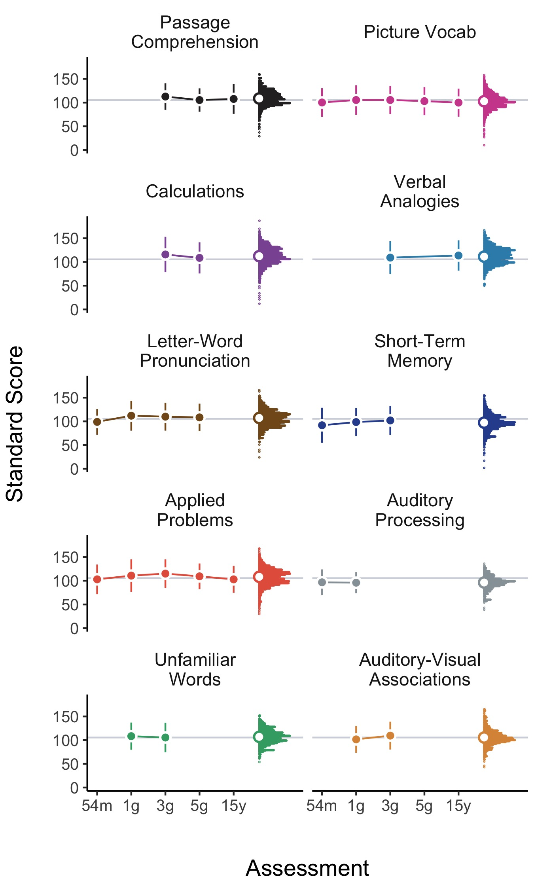

# Abstract

The idea that some abilities might be enhanced by adversity is gaining
traction. Adaptation-based approaches have uncovered a few specific
abilities enhanced by particular adversity exposures. Yet, for a field
to grow, we must not dig too deep, too soon. In this paper, we
complement confirmatory research with principled exploration. We draw on
two insights from adaptation-based research: 1) enhanced performance
manifests within individuals, and 2) reduced and enhanced performance
can co-occur. Although commonly assumed, *relative* performance
differences are rarely tested. To quantify them, we need a wide variety
of ability measures. However, rather than using adaptive-logic to
predict which abilities are enhanced or reduced, we develop statistical
criteria to identify three data patterns: reduced, enhanced, and intact
performance. With these criteria, we analyzed data from the NICHD Study
of Early Child Care and Youth Development to investigate how adversity
shapes within-person performance across 10 abilities in a cognitive and
achievement battery. Our goals are to document adversity-shaped
cognitive performance patterns, identify drivers of reduced performance,
identify sets of ‘intact’ abilities, and discover new enhanced
abilities. We believe principled exploration with clear criteria can
help break new theoretical and empirical ground, re-map old territory,
and advance theory development.



# How does adversity relate to performance across different abilities within individuals?

Developmental science commonly asserts that adversity-exposure during
development reduces cognitive performance—a claim founded on decades of
empirical findings (Duncan et al., 2017; Farah et al., 2006; Fraley et
al., 2013; Hackman et al., 2010; McLaughlin et al., 2019; Raby et al.,
2015). In recent years, however, adaptation-based frameworks, rooted in
the idea that adversity might enhance certain abilities, have
complemented this work (Ellis et al., 2017; Ellis et al., 2022;
Frankenhuis, Young, et al., 2020; Frankenhuis & de Weerth, 2013;
Frankenhuis & Nettle, 2020). Since their inception, the goal of
adaptation-based frameworks has been to inspire a more well-rounded view
of adversity and its influence on abilities—one that incorporates both
the struggles and strengths of people from disadvantaged backgrounds
(Frankenhuis & de Weerth, 2013). As such frameworks develop further, the
core task of adaptation-based research is to “uncover a high-resolution
map of specific cognitive abilities that are enhanced as a result of
growing up under high-adversity conditions” (Ellis et al., 2017, p.
562). To do so, researchers to date have used confirmatory study
designs, which have gleaned useful insights. However, to cultivate
growth in an emerging research program—where there is little known and
much to learn—we must not dig too deep, too soon. Without complementary
approaches, exclusive use of confirmatory designs can create tunnel
vision and miss new insights and findings (McIntosh, 2017; Roisman,
2021; Rozin, 2001; Scheel et al., 2021). Research programs benefit from
taking a pluralistic approach, especially in the early stages. Based on
this realization, there have been calls for more observational and
exploratory research, alongside confirmatory research, both for the
psychological sciences generally (Roisman, 2021; Scheel et al., 2021)
and for the study of human evolution and behavior in particular
(Barrett, 2020).

In this paper, we use a complementary approach to confirmatory research:
principled exploration. To guide our exploration, we build on two basic
insights from adaptation-based research: 1) enhanced performance
manifests within individuals, and 2) reduced and enhanced performance
can co-occur. The first insight implies we need designs and models that
can tease apart both within- and between-person performance differences.
The second suggests that, in order to map out more of the
adversity-ability landscape, we must examine multiple abilities measured
within the same person. Doing so will allow us to describe cognitive
performance in three distinct data patterns: reduced, intact, and
enhanced performance. Past research has focused primarily on reduced and
enhanced performance on tests of single abilities. However, we know
little about intact abilities, defined as cases in which test
performance is unrelated to adversity exposure. Our goal, therefore, is
to document adversity-shaped cognitive performance patterns that include
reduced performance, intact abilities, *and* enhanced test performance
patterns.

# Essential Features and Empirical Insights from Adaptation-based Frameworks

Adaptation-based research has two essential features. First, such
research assumes that development shapes the individual, as well as
their abilities, to fit their local environment (Frankenhuis, Young, et
al., 2020). Second, because environments differ in the challenges they
pose (e.g., resource-scarcity versus violence exposure), development
also shapes abilities according to specific challenges. Thus, one’s
abilities should match the challenges of an individual’s lived
experience. These features are useful guideposts for confirmatory
hypothesis generation. Using them as building blocks, it is possible to
construct an intuitive bridge between an ability and an environmental
challenge. For example, a researcher might identify a specific challenge
posed by a dimension of adversity (e.g., threats to safety in high-crime
neighborhoods) and an ability needed to meet the challenge (e.g.,
enhanced threat detection).

This approach is appealing because it forces researchers to be specific
and logically tie together challenges and abilities. It has also been
successful in discovering a handful of adversity-enhanced abilities,
especially in harsh and unpredictable environments. For example, some
scholars have proposed that constantly changing environments (i.e.,
unpredictable environments) might shape the ability to track and respond
to changing information. Using this logic, prior research has built an
intuitive bridge between changing environments and two specific
abilities–attention-shifting and working memory updating—and some
empirical results are consistent with this logic (e.g., Fields et al.,
2021; Mittal et al., 2015; Nweze et al., 2021; Young et al., 2018).

There are two limitations to this approach. First, previous studies are
difficult to compare because they use different measures and designs.
Second, the logic behind confirmatory hypotheses can be easily flipped.
For example, exposure to unpredictable environments is thought to reduce
inhibition, or the ability to resist distractions. If opportunities are
fleeting and threats are unpredictable, inhibition is costly because
focusing on long-term goals might cause one to miss opportunities or
fail to detect a threat. However, we can also assert the exact opposite.
For example, inhibition might be enhanced by unpredictable environments
because attending to every possible opportunity or threat will derail
most goal-directed actions. Thus, adaptive logic can afford different or
(in some cases) opposing hypotheses. This does not diminish the
enterprise—empirical research is the ultimate arbiter—but there is a
risk of becoming too focused on a particular corner of hypothesis space,
when other regions would be just as reasonable to explore (Andrews et
al., 2002; Ketelaar & Ellis, 2000; Lewis et al., 2017). It is important
to recognize that just because adaptive logic can be reversed does not
make it invalid. Instead, we highlight that, by design, adaptive logic
restricts inquiry to those abilities for which it can be constructed.

Adaptation-based research has also focused on testing content, or the
notion that performance should improve when the testing content matches
the lived experience of people exposed to adversity. For example,
studies have examined relational memory, attention shifting, and working
memory task performance using more ecologically-relevant testing content
(e.g., social dominance, real-world, and socioemotional stimuli)
compared to neutral or abstract content. In some cases,
ecologically-relevant content tends to equalize performance for people
exposed to adversity, but this depends on the specific adversity measure
and task (Frankenhuis, de Vries, et al., 2020; Rifkin-Graboi et al.,
2021; Young et al., 2022). In other studies, however, conditions thought
to be well-matched to the lived experience of those exposed to adversity
actually lower performance. For example, youth from low socioeconomic
backgrounds tend to score lower on math items about social relations,
money, and food—items thought to be particularly relevant to lived
experience—compared to other math items (Duquennois, 2022; Muskens,
2019).

In light of these caveats, this body of work has generated at least two
broad empirical insights. First, although it is possible for adversity
to enhance performance between individuals (e.g., low versus high
adversity exposure), empirical findings suggest effects mostly occur
*within* individuals (Fields et al., 2021; Frankenhuis, de Vries, et
al., 2020; Young et al., 2022). Second, associations between specific
types of adversity and enhanced performance appear to be context
specific—enhancements depend on the testing content, context, and
ability type (Fields et al., 2021; Frankenhuis, de Vries, et al., 2020;
Mittal et al., 2015; Nweze et al., 2021; Young et al., 2018; Young et
al., 2022). As a result, we know little about how enhanced abilities
relate to broader sets of ability measures.

# **Motivating Principled Exploration**

We believe that adaptation-based frameworks offer useful guidance.
However, it is essential to use shovels, not scalpels, when breaking new
theoretical and empirical ground. Emerging research programs have yet to
lay the basic groundwork for testing theories, such as key auxiliary
assumptions or boundary conditions (Scheel et al., 2021). Our goal is to
complement adaptation-based, confirmatory research with principled
exploration (Flournoy et al., 2020; Rozin, 2001).

To motivate principled exploration, we can compare how it differs from
confirmatory approaches. Both start with a research question, such as
“How does adversity exposure shape cognitive performance?” A
confirmatory approach then generates hypothesis and predictions. For
example, the hypothesis “cognitive abilities are shaped by adaptive
challenges in one’s local environment” can lead to the prediction
“individuals exposed to unpredictable environments enhance attention
shifting to track changes.” Useful predictions are clear and specific.
Methods and analysis are then chosen based on their potential to reveal
the expected result.

Principled exploration approaches the research question differently.
Instead of generating hypotheses and predictions, it asks, “What are the
logically possible ways adversity might shape cognition?” This prompts
us to define different scenarios like “unpredictability could enhance,
reduce, or leave attention shifting intact.” We then design methods and
analyses to distinguish between these possibilities and select those
with the best potential to discern possible outcomes. In this sense,
principled exploration shifts the focus from finding an expected pattern
to exploring alternative patterns and describing which empirical
patterns constitute evidence for and against different possibilities.

Confirmatory approaches use predictions like a scalpel – they attempt to
carve out a narrow space for an expected result. They work best when
much ground has already been coarsely excavated and ready for precise
incision. In contrast, when little ground has been broken, we need a
strategy for broad excavation and tools for exposing the general
contours of what is underneath. In the words of Paul Rozin: “Just as
biologists have learned about life by studying different species and
different environments, we would do well to open our eyes more widely
before we dig too deep a hole at one place in the broad and varied
terrain of human social life” (Rozin, 2001, p. 13).

Principled exploration can benefit both deficit and adaptation-based
research. In a field dominated by confirmatory approaches, it encourages
re-examination of assumed and established patterns with a new lens. For
example, both deficit- and adaptation-based perspectives assume that
adversity should reduce performance on standard assessments of cognitive
ability (Ellis et al., 2022; Frankenhuis, Young, et al., 2020; Hackman
et al., 2010; McLaughlin et al., 2019; Ursache & Noble, 2016). Yet,
these tests are often comprised of many different subtests, and
individual tests may show unique patterns that diverge from widely used
composite scores (e.g., Fraley et al., 2013; Raby et al., 2015). For the
deficit literature, principled exploration prompts a closer examination
of such tests, because it is clear deficits are not the only possible
outcome. For adaptation-based approaches, a broad but systematic
exploration can help generate better and more precise hypotheses and
predictions.

More broadly, principled exploration adds important descriptive
information to the theory or model believed to account for a given set
of findings. One reason why we know relatively little about broad sets
of abilities is that adaptive logic has not been developed for some
abilities. However, the lack of such logic does not imply the presence
or absence of a functional link. A complementary approach involves
exploring, describing, and then following up associations between
adversity and abilities to advance theory development. One can then
return to the larger set of cognitive abilities shaped by adversity and
ask, “What territory needs exploration and which areas may need
re-mapping?”

The cornerstones of principled exploration are clear inferential
criteria. For example, rather than generating adaptive logic to predict
which abilities are enhanced or reduced, we can develop criteria that
can discern between data patterns. Confirmatory research typically
focuses on reduced versus enhanced test performance, but performance on
some tests might remain intact (unaffected) by exposure to adversity
(Frankenhuis, Young, et al., 2020). We know little about the intact
performance of people exposed to adversity. We also know little about
the drivers of reduced performance on broad and generic measures of
ability and achievement. For example, deficit approaches have collapsed
many abilities into composites and have found that adversity exposure
tends to be associated with reduced performance (Fraley et al., 2013;
Raby et al., 2015). One possibility, however, is that a smaller set of
specific performance measures are driving effects. In sum, there is much
to learn about how adversity shapes cognitive abilities. Principled
exploration can complement confirmatory research to draw a more complete
and accurate map of the theoretical and empirical terrain, especially in
the early stages of a new field.

# The Current Study

We conduct a principled exploration of how adversity relates to
performance on a widely-used cognitive achievement battery – the
Woodcock-Johnson (WJ) – using prospective, longitudinal data from the
NICHD Study of Early Childcare and Youth Development (SECCYD). Drawing
on the general insights of adaptation-based research, we employ a
within-person performance design to explore performance across 10
abilities. This design allows us to assess how exposure to each measure
of adversity is associated with relative performance differences across
several abilities (see Figure 1). Cast another way, we can compare
specific abilities (e.g., short-term memory performance) to overall
performance (within-person average performance on all tests) to gain a
clearer picture of how enhanced and reduced performance manifest in
parallel within an individual.

The Woodcock-Johnson is an ideal measure for principled exploration for
two reasons. First, some theory actively turns inquiry away from tests
like the Woodcock-Johnson. This might happen because there are no
current adaptive hypotheses about performance on the Woodcock-Johnson
and adversity exposure or researchers uniformly assume performance
should be reduced because it is a general/abstract test battery. Yet, if
we take a step back and return to our goal of drawing a high-resolution
map of abilities enhanced by adversity, the Woodcock-Johnson and its
subtests are clearly of interest as it measures a diverse set of
abilities. Second, the Woodcock-Johnson contains many diverse subscales
measuring different aspects of cognitive performance, each of which was
measured multiple times. These subscales can be used to measure general
ability (e.g., *g*) by averaging all subscales and they can be used
individually. This makes it a desirable assessment for comparing and
contrasting a general overall ability to specific abilities to uncover
relative performance patterns.

We focus on adversity measures of two constructs, environmental
harshness and unpredictability, because they are often featured in
adaptation-based research on cognitive abilities (Ellis et al., 2017;
Ellis et al., 2022; Fields et al., 2021; Frankenhuis, Young, et al.,
2020; Mittal et al., 2015; Young et al., 2018; Young et al., 2022).
Conceptually, harshness is defined as external causes of
mortality-morbidity and unpredictability is defined as random variation
in harshness over space and time (Ellis et al., 2009). To measure
harshness, studies typically use socioeconomic indicators, such as
income (Belsky et al., 2012; Doom et al., 2016, 2022; Hartman et al.,
2018; Li et al., 2018; Simpson et al., 2012; Sung et al., 2016;
Szepsenwol et al., 2015, 2019; Zhang et al., 2022). To measure
unpredictability, studies have used a variety of approaches (see Young
et al., 2020), including counting family transitions and computing
variability in income scores (Belsky et al., 2012; Hartman et al., 2018;
Li et al., 2018).

In the current study, we leverage both previously-used (i.e., income for
harshness; family transitions and income variability for
unpredictability) and unexplored measures of both constructs. Unexplored
measures include neighborhood disadvantage (i.e., the mean for harshness
and the variability for unpredictability). We leverage data from the
1990 Census to index the individuals’ neighborhood ecological context,
which has been used in the SECCYD previously (Bleil, Spieker, et al.,
2021; Bleil, Appelhans, et al., 2021).

We use two sets of criteria for evaluating our results. First, our
expectations change according to the conceptual framework. For example,
from a traditional deficit perspective, we would expect negative overall
effects of adversity. Performance on subtests should closely match the
overall effect. In contrast, from an adaptation-based perspective, we
would expect an overall negative effect, but performance on some
subtests may be either less reduced, intact, or even enhanced.

Our second set of criteria are statistical. Our modeling strategy allows
us to quantify performance as a function of adversity in two ways.
First, we can test whether the effect of adversity on each subtest is
different from zero using a simple slopes test. A positive and negative
effect suggests enhanced and reduced performance, respectively. Second,
we can compare subset performance (simple slopes) against overall
performance (the main effect of adversity across all tests), which is
measured by the interaction between subtest category and adversity. This
interaction term indicates whether performance is significantly more
negative, less negative, or positive compared to overall performance.
For both types of effects, we can then determine whether they are
practically equivalent to either zero (a simple effect) or overall
performance (a main effect). Subtest performance is intact when the
effect of adversity on a subtest is practically equivalent to zero.
Using these criteria, we can position ourselves to identify the drivers
of reduced overall cognitive performance, map out sets of ‘intact’
cognitive abilities, and discover possible enhancements.  

# Method

## Participants

Families were initially recruited for the NICHD SECCYD in 1991. A total
of 1364 families met all the prescreening criteria, namely that mothers:
were age 18 or older, did not plan to move, had a newborn without any
known disabilities (and could leave the hospital within one week), had
no history of substance abuse, could speak English, lived within one
hour driving distance from the research lab, and were in a relatively
safe neighborhood (NICHD ECCRN, 2005). More information about
recruitment and selection procedures is available from the study (see
<https://www.icpsr.umich.edu/web/ICPSR/series/00233>). The current
analyses included participants with non-missing data on most predictors
and outcome variables through age 15 years (*N* = 1156). In terms of
race and ethnicity, the sample was mostly White (*n* = 940) with the
remaining mothers reporting their child as Black (*n* = 138), Asian or
Pacific Islander (*n* = 18), Native American, Eskimo, or Aleutian (*n* =
5), or another racial/ethnic group (*n* = 55).

## Measures

### **Cognitive Ability Test Battery**

We used the Woodcock-Johnson (WJ) Cognitive and Achievement standardized
test battery to examine performance across 10 subtests (Woodcock et al.,
1990; Woodcock, 1990). The SECCYD administered the WJ five times: in the
54th month, 1st grade, 3rd grade,
5th grade, and 15-year assessments.

There are two WJ test batteries: the cognitive and achievement tests.
The WJ cognitive test includes the Memory for Names, Memory for
Sentences, Verbal Analogies, Incomplete Words, and Picture Vocabulary
subtests (described later). The WJ achievement battery includes
Letter-Word Identification, Passage Comprehension, Calculations, Applied
Problems, and Word Attack subtests (described later).

For all tests, we analyzed standard scores, which are equivalent to IQ
scores (e.g., *M* = 100, *SD* = 15). Using standard scores for subtests
puts all tests on the same scale to facilitate comparison (see Figure
2). For each subtest, we averaged standard scores over time to create
one score per subtest, per participant. However, the specific set of
subtests administered at each assessment varied (see Figure 2). For
example, the Verbal Analogies test was measured at grade three and age
15, whereas Passage Comprehension was measured at grades 3, 5, and age
15 (see Table 1). Thus, to create overall scores for each subtest, we
averaged over all time-points available for each subtest (see
<https://github.com/ethan-young/seccyd-wj-subtests/blob/master/scripts/2-aggregate-dvs.R>
for code).

  

  

**Picture Vocabulary.** This subtest measures verbal comprehension and
crystallized knowledge. The test contains 58 items requiring
participants to view and name familiar and unfamiliar objects. The test
was administered five times: at 54 months, grades 1, 3, 5, and at 15
years. Higher scores indicate more verbal comprehension and more
crystallized knowledge.

**Verbal Analogies.** This subtest measures the ability to reason about
analogies between relatively simple words. Although the words remain
simple, relations between words increase in complexity of over the test
items. The test contains 35 items and was assessed twice: at grades 3
and 5. Higher scores indicate more reasoning and more
verbal/crystallized knowledge.

**Passage Comprehension.** This subtest test measures the ability to
read a short passage and name an appropriate key word that is missing.
The test contains 43 items and was administered three times: at grades
3, 5, and at age 15. Higher scores indicate more vocabulary,
comprehension, and reading skill.

**Applied Problems.** This subtest contains a set of practical math
problems. Participants must read and identify a strategy for solving the
problem and execute simple arithmetic calculations. The test contains 60
items and was administered five times: at the 54-month, 1st,
3rd and 5th grade, and 15-year assessments. Higher
scores indicate more practical math and problem-solving skill.

**Calculations.** This subtest required participants to solve
traditional math problems containing addition, subtraction,
multiplication, division, and different combinations of each. The test
also includes some geometry and trigonometry problems. Some items
require logarithmic operations and calculus. The test contains 58 items
and was administered twice: at the 3rd and 5th
grade assessments. Higher scores indicate more mathematical/quantitative
skill.

**Auditory-Visual Associations.** This subtest (also called Memory for
Names) is an auditory-visual association test. It requires participants
to learn a set of ‘space creatures’ and their names. After learning a
set of creature-name pairs, participants are presented with nine
creatures and must identify which were just shown and which were shown
previously. The test difficulty is controlled by (decreasing) increasing
the creature-name pairs presented in each set. The test contains 72
items and was administered twice: at the 1st and
3rd grade assessments. Higher scores indicate more
visual-auditory association and long-term memory skill.

**Auditory Processing.** This subtest (also called the Incomplete Words
test) measures the ability to listen to words containing missing
phonemes and complete the word. The test contains 40 items and was
administered twice: at the 54 month and 1st grade
assessments. Higher scores indicate more auditory processing skill.

**Short-term Memory.** This subtest (also called the Memory for
Sentences test) measures the ability to listen to and remember words,
phrases, and sentences. The words, phrases, and sentences are played on
an audio tape and participants must recall as many as possible. The test
contains 32 items and was administered three times: at the 54-month,
1st grade, and 3rd grade assessments. Higher
scores indicate more short-term memory skill.

**Letter-word Pronunciation.** This subtest measures reading and
pronunciation ability. Participants must initially read letters and then
words, which gradually increase in difficulty. The test contains 57
items and was administered four times: at the 54-month, 1st,
3rd, and 5th grade assessments. Higher scores
indicate more verbal knowledge.

**Unfamiliar Words.** This subtest (also called Word Attack) measures
the ability to pronounce unfamiliar words. Participants must read aloud
phonetically logical but nonsense or infrequent words. It contains 30
items and was administered twice: at the 1st and
3rd grade assessments. Higher scores indicate more auditory
processing and linguistic structural analysis knowledge and skill.

  

### Indicators of Harshness

We measured environmental harshness in two ways. First, following
previous studies using data from the SECCYD, we used family
income-to-needs ratio scores from the 1, 6, 15, 24, 36, and 54-month
assessments (Belsky et al., 2012; Hartman et al., 2018; Li et al., 2018;
Sung et al., 2016; Zhang et al., 2022). We calculated a simple average
of all income-to-needs scores across assessments to create an overall
income-to-needs score (see
<https://github.com/ethan-young/seccyd-wj-subtests/blob/master/scripts/2-merge-aggregate-ivs.R>
for code). We reverse-scored income-to-needs mean scores to create a
family income disadvantage score, where higher values indicate more
disadvantage.

Second, we used data from the 1990 Census about participants’ broader
economic and ecological context in a similar way to previous analyses of
neighborhood-level socioeconomic conditions in the SECCYD (Bleil,
Spieker, et al., 2021; Bleil, Appelhans, et al., 2021). Specifically,
addresses were tracked for each participant over time. Each family
address start and stop dates were recorded, geocoded, and linked to the
1990 decennial Census block groups. These block groups are the smallest
Census-tracked geographical unit released for external analysis. For
each Census block group, sociodemographic data were extracted from the
Census databases to measure neighborhood-level economic conditions for
each participant.

We extracted five variables: 1) percent of people living under the
poverty line, 2) median household income, 3) Gini coefficients of income
inequality based on income frequency data, 4) percent of unemployed
individuals over age 16 in the workforce, and 5) the percent of occupied
houses that were being rented. These neighborhood variables were
standardized and then averaged to create a neighborhood socioeconomic
disadvantage score for each home in which a participant lived. Next, we
averaged these neighborhood scores over time (up until the 54-month
assessment). Thus, if a participant lived in two homes between birth and
the 54-month assessment, neighborhood-level variables were standardized
and averaged within the first and second Census block group, and then
averaged between them. These scores served as measures of neighborhood
socioeconomic disadvantage where higher scores indicate higher rates of
poverty, income-inequality, unemployment, lower education, and more
rental housing (see
<https://github.com/ethan-young/seccyd-wj-subtests/blob/master/scripts/1-compile-ivs-census.R>
for processing and aggregation).

### **Indicators of Unpredictability**

Environmental unpredictability is harder to define and measure (Young et
al., 2020). Studies leveraging data from the SECCYD have used two
approaches. The first is to track and count family transitions,
including changes in paternal figures living in the home, parental job
transitions, and residential changes (Belsky et al., 2012; Hartman et
al., 2018; Simpson et al., 2012). The second approach is to quantify
variability in repeated measures of harshness indicators (e.g.,
computing variance in family income disadvantage across time). For
example, Li and colleagues (2018) fit a linear model to each
participants’ income-to-needs scores over time. Then, they computed the
residual variance around participant-level linear trends in
income-to-needs to create an income variability score. In the current
study, we compute unpredictability scores using both approaches and
extend the Li and colleagues (2018) approach to the neighborhood-level
Census block-group data.

To calculate family transitions, we computed the number of paternal
figure changes (father figures moving in and out of the home), mother
and father (figure) job changes, and residential changes across 17
assessments from 1 to 54 months (Belsky et al., 2012; Hartman et al.,
2018). After computing scores across time, we standardized each variable
and averaged them to compute an overall family transitions variable (see
<https://github.com/ethan-young/seccyd-wj-subtests/blob/master/scripts/2-merge-aggregate-ivs.R>
for code).

We next calculated variability scores for both family income and
neighborhood socioeconomic disadvantage. For family income disadvantage
scores, we computed a standard deviation of all income-to-needs scores
for each participant from the 1, 6, 15, 24, 36, and 54-month assessments
(see
<https://github.com/ethan-young/seccyd-wj-subtests/blob/master/scripts/2-merge-aggregate-ivs.R>
for code). For neighborhood socioeconomic disadvantage variability, we
computed the standard deviation of neighborhood socioeconomic
disadvantage scores (see Indicators of Harshness, above). If
participants had only lived in one Census block group from 1 to 54
months, their neighborhood socioeconomic disadvantage variability score
was zero.

### **Control Variables**

We used a standard set of three control variables typically used in
analyses of SECCYD data: 1) maternal education, 2) sex assigned at birth
(1 = female; 0 = male), and 3) the race/ethnicity of each child coded as
White/non-Hispanic = 0, otherwise = 1. We chose to code race/ethnicity
this way because the SECCYD sample is mostly White, making the sample
sizes for other racial/ethnic groups small.

  

# Results

## Preregistration, Statistical Power, and Computational Reproducibility

We preregistered this study using a template for secondary data analysis
(Akker et al., 2021). The preregistration document and its entire
version history was tracked on GitHub (see
<https://github.com/ethan-young/seccyd-wj-subtests/tree/master/preregistration>).

We also conducted a power analysis as part of our preregistration (see
<https://github.com/ethan-young/seccyd-wj-subtests/tree/master/preregistration/power-analysis>
for write up and see
<https://github.com/ethan-young/seccyd-wj-subtests/blob/master/scripts/prereg-power-simulation.R>
for code). We used a simulation approach to conduct power analyses.
These analyses were based on simulated adversity scores and actual WJ
test scores from the SECCYD data used in this study. We used actual WJ
test scores in order to fully leverage their variance-covariance
structure. Simulations showed that, with a sample size of (*N* = 1156),
the smallest interaction effect we can detect is $\beta$ = -.075 (or
.075) with 90% power, if error is small. When error is larger, we can
detect the same effect size with only 65% power. However, even with
larger error, we can detect a $\beta$ = -.10 (or .10) with 83% power.

All relevant files (data processing, analysis code, manuscript etc.) for
this project are tracked on GitHub (see
<https://github.com/ethan-young/seccyd-wj-subtests/tree/master>),
including the data needed to reproduce all results (see
<https://github.com/ethan-young/seccyd-wj-subtests/tree/master/data>).
Raw data (data provided by the SECCYD) is available only via
Inter-university Consortium for Political and Social Research (ICPSR,
see <https://www.icpsr.umich.edu/web/pages/>). However, documentation
for the study is free to download (see
<https://www.icpsr.umich.edu/web/ICPSR/studies/21940>), which contains
lists of raw datasets and variables. For those who have access to raw
SECCYD data, we provide a table of raw datasets and variables used in
this project (see
<https://github.com/ethan-young/seccyd-wj-subtests/tree/master/data>).

We used R, Rstudio, and Quarto to process, analyze, and report results
(Allaire, 2022; Posit team, 2023; R Core Team, 2023). For reading raw
SECCYD data, we used the haven and readxl R packages (Wickham et al.,
2023; Wickham & Bryan, 2023). For data processing, visualizations, and
table creation, we used the tidyverse, sjlabelled, ggdist, ggsci,
flextable, and the patchwork R packages (Gohel & Skintzos, 2023; Kay,
2023; Lüdecke, 2022; Pedersen, 2022; Wickham et al., 2019; Xiao, 2023).
For analyses, including mixed models, simple slopes, and equivalence
tests, we used lme4, faux, ggeffects, marginaleffects, multitool, and
the parameters R packages (Arel-Bundock, 2023; Bates et al., 2015;
DeBruine, 2023; Lüdecke, 2018; Lüdecke et al., 2020; Young & Vermeent,
2024).

## Data Analysis Strategy and Inferential Criteria

We used a mixed effects modeling approach to analyze how adversity
relates to WJ performance. For our primary analyses, we ran one model
per adversity variable. Each model contained sex assigned at birth,
race/ethnicity, and maternal education as covariates. Adversity and
covariates were standardized or recoded to center these variables at
zero.

To analyze and compare WJ subtest performance with overall WJ
performance, we restructured the data so that each participant was
represented by 10 rows, one for each WJ subtest score. Then, we created
a sum-coded contrast variable for WJ subtests with 10 levels (one for
each subtest). This type of contrast sets the model intercept to the
grand mean (i.e., the mean of all subtest scores). To analyze the
effects of adversity on test performance, we entered adversity as a main
effect and the interaction between adversity and the contrast-coded
subtest variable.

A model with this structure contains a main effect for each covariate, a
main effect of adversity, and an interaction term for each subtest
(i.e., 10 interaction terms). The main effect of adversity reflects the
association between adversity and overall WJ performance (i.e.,
within-person average across all subtests; see Figure 1). Interaction
terms reflect the association between adversity and subtest performance
*compared to the main effect of adversity* (see Figure 1). That is, they
reflect the difference between the effect of adversity on overall
performance and simple effects of adversity on subtest performance.
Whereas simple effects test whether an association between adversity and
subtest performance is different from zero, interaction terms measure
whether a simple effect is different from the main effect.

Using this modeling strategy, we computed three types of effect
sizes: 1) the main effect of each adversity measure (tested in separate
models), 2) the interaction effect between an adversity measure and
subtest, and 3) the simple effect of adversity for each subtest. We did
not have specific point or range predictions for the effect size types
above. However, we decided a priori to consider standardized regression
coefficients (i.e., $\beta$’s) of .10 (or higher) and -.10 (or lower) as
meaningful, or large enough to serve as a basis for future confirmatory
research. For main effects, coefficients outside this range indicate
that overall performance is meaningfully positive or negative across
levels of adversity. For interactions, effect sizes outside these bounds
indicate that associations between adversity and subtest performance are
meaningfully more negative or more positive than overall performance.
For simple effects, effects outside these bounds indicate that the
effect of adversity on a specific subtest is meaningfully different from
zero.

We were also interested in null effects. Specifically, we used
equivalence testing to determine whether a given effect is practically
equivalent to a Range of Practical Significance (ROPE). We chose a ROPE
falling between $\beta$ = -.10 and $\beta$ = .10 (Kruschke, 2018; Lakens
et al., 2018). Although we report standardized coefficients, we
converted our ROPE to the WJ standard score scale by multiplying the
standard deviation of standard WJ scores (*SD* = 15) by .1. Thus, our
ROPE was -1.5 to 1.5 for unstandardized coefficients.

To guide interpretation, we also applied a set of inferential criteria
for categorizing data patterns. We were interested in three data
patterns: 1) enhanced performance, 2) reduced performance, and 3) intact
performance. We inferred ‘enhanced performance’ when main and simple
effects were positive, statistically different from zero, and outside
the ROPE. We inferred ‘reduced performance’ when main and simple effects
were negative, statistically different from zero, and outside the ROPE.
We inferred intact performance when a main or simple effect (and its
confidence bounds) was practically equivalent to zero (i.e., fell inside
the ROPE), irrespective of statistical significance.

We used the same criteria for interaction terms with one difference.
Because interaction terms test the difference between main and simple
effects, they quantify relative performance patterns. For ‘enhanced
relative performance’, interaction terms must be meaningfully positive
(outside the ROPE) and statistically significant. For ‘reduced relative
performance’, an interaction term must be meaningfully negative (outside
the ROPE) and statistically significant. Interaction terms that are
practically equivalent to zero reflect simple effects that closely
resemble the main effect on overall performance. However, inferring
‘enhanced’, ‘reduced’, or ‘intact’ relative performance depends on the
size and direction of the main effect. We were particularly interested
in cases where a main effect is negative and interaction terms are
positive. This may reflect either ‘enhanced relative performance’ (e.g.,
meaningful and significant positive interactions) or ‘less reduced’
performance on a particular subtest in the context of an overall reduced
pattern of performance.

## Primary Analyses

Our primary analyses examined how indicators of harshness and
unpredictability were associated with WJ overall and subtest
performance. We ran one mixed model per indicator for a total of five
primary analyses (two for harshness and three for unpredictability). We
use our statistical models for description and our inferential
criteria–which include equivalence tests—to unpack data patterns.
Although these analyses are exploratory (i.e., we are not testing
specific hypotheses), we correct for multiple testing for all
interaction term and simple slope *p-*values using the
Benjamini-Hochberg approach (Benjamini & Hochberg, 1995).

All analyses controlled for the main effects of maternal education,
race/ethnicity, and sex assigned at birth. Across all models, there were
main effects for both maternal education and race/ethnicity. Lower
maternal education and having a non-White racial/ethnic background was
associated with lower WJ overall performance. No model contained
statistically significant effects for sex assigned at birth. Below we
describe the effects of our primary analysis predictors (see
Supplemental Materials for full model results). Primary analysis code
can be found on GitHub (see
<https://github.com/ethan-young/seccyd-wj-subtests/blob/master/scripts/3-primary-analysis.R>).

### Indicators of Harshness

**Overview**. In general, exposure to more income- and
socioeconomic-related indicators of harshness was associated with
reduced overall WJ performance. For both family income and
neighborhood-level socioeconomic disadvantage, seven out of 10 WJ
subtests were reduced. Performance was particularly reduced for the
Picture Vocabulary and Verbal Analogies subtests. However, across both
family and neighborhood models, economic disadvantage appeared to leave
the Auditory Processing and Auditory-Visual Associations subtests intact
(see below and Figure 3; see Supplemental Materials for full regression
tables).

**Family Income Disadvantage (mean)**. Our mixed model analyzed the
effect of family income disadvantage on overall compared with subtest WJ
performance. There was a main effect of family income disadvantage such
that a higher disadvantage was associated with lower overall WJ
performance. Equivalence tests show that this overall main effect was
meaningfully negative (outside the ROPE, see Figure 3).

Interaction effects between family income disadvantage and subtests
revealed a more nuanced pattern of associations. The association between
disadvantage and performance did not differ from the overall main effect
for the following subtests: Passage Completion, Calculations, Verbal
Analogies, Letter-Word, and Short-Term Memory (see Figure 3). However,
the association between income disadvantage and performance on the
Picture Vocabulary subtest was significantly and meaningfully more
negative than the overall main effect (see Figure 3). Interestingly, the
association between disadvantage and performance on the Auditory
Processing, Unfamiliar Words, and Auditory-Visual Associations subtests
were significantly more positive than the overall main effect (see
Figure 3). However, equivalence tests suggest that the income
disadvantage and Unfamiliar Words performance association was inside the
ROPE and, thus, practically equivalent to the main effect. The
associations between income disadvantage and Auditory Processing and
Auditory-Visual performance were outside the ROPE, suggesting
performance was meaningfully more positive than the main effect for
those with income disadvantaged families.

Our simple effects analysis tested whether the associations between
family income disadvantage and subtest performance was statistically
different from zero and whether they were practically equivalent to the
ROPE (see Figure 3). Analyses revealed that the association between
family income disadvantage and each of the subtests where significantly
and meaningfully negative, except for the Auditory Processing,
Unfamiliar Words, and Auditory-Visual Associations subtests (see Figure
3). For these tests, the association between income disadvantage and
test performance was not statistically different from zero and
practically equivalent to the ROPE (see Figure 3), suggesting
performance on these tasks was intact.

**Neighborhood Socioeconomic Disadvantage (Mean)**. Analyses revealed a
main effect of neighborhood socioeconomic disadvantage, such that living
in high neighborhood socioeconomic disadvantage was associated with
reduced overall WJ performance (see Figure 3). Equivalence tests show
that this overall main effect was outside the ROPE.

Interaction effects between neighborhood socioeconomic disadvantage and
subtests were varied. The association between socioeconomic disadvantage
and performance did not statistically differ from the overall main
effect for the following subtests: Passage Completion, Letter-Word
Pronunciation, Short-Term Memory, and Unfamiliar Words (see Figure 3).
However, associations were significantly more negative than the main
effect for Picture Vocabulary, Calculations, Verbal Analogies, and
Applied Problems subtests (see Figure 3). However, equivalence tests
revealed that only the association between socioeconomic disadvantage
and Verbal Analogies subtest performance was meaningfully more negative
than the main effect.

Similar to the family income disadvantage analysis, neighborhood
socioeconomic disadvantage was associated with significantly more
positive performance for the Auditory Processing and Auditory-Visual
Associations compared to the overall main effect. Equivalence tests
revealed that both associations were also meaningfully more positive,
suggesting that performance on these tests was relatively enhanced
(compared to the main effect) for participants living in
socioeconomically disadvantaged neighborhoods (see Figure 3).

Simple effects revealed that higher neighborhood socioeconomic
disadvantage was associated with statistically and meaningfully negative
performance for all subtests except for the Auditory Processing and
Auditory-Visual Associations subtests. For these two subtests,
performance among those living in socioeconomically disadvantaged
neighborhoods was not statistically or meaningfully different from zero,
suggesting an intact pattern of performance.

### Indicators of Unpredictability

**Overview**. In general, exposure to more unpredictability, indexed by
family transitions and neighborhood socioeconomic variability, was
associated with intact overall WJ test performance (see below and Figure
4; see Supplemental Materials for full regression tables). Only one WJ
subtest showed a deviation from the overall pattern–Applied
Problems–which was associated with reduced performance among
participants who experience more family transitions (see Figure 4).
Results for family income variability raised a number of questions,
which we address in our Secondary Analyses (see below for details).

**Family Transitions**. Our analysis of family transitions revealed no
main effect on overall WJ performance. The main effect also fell inside
the ROPE range, suggesting that overall performance was not associated
with exposure to more family transitions (see Figure 4).

Three interaction terms were statistically significant: Calculations
(more negative), Auditory Processing (more positive), and Audio-Visual
Associations (more positive). However, only the association between
family transitions and performance on the Calculations subtest was
meaningfully different from the main effect (see Figure 4).

Simple effects indicated that exposure to family transitions was only
associated with the Calculations and Applied Problems subtests. For
Calculations, exposure to more family transitions was associated with
significantly and meaningfully lower performance. For Applied Problems,
more family transitions were associated with meaningfully lower
performance, but this difference was not statistically different from
zero (i.e., the association was not significant and outside the ROPE).

**Family Income Variability (*SD*).** Models examining the effect of
family income variability on WJ overall and subtest performance yielded
surprising results. Specifically, the directions of all effects were
opposite to analyses using family income average scores. For subtests
that showed reduced performance at high *mean* levels of family income
disadvantage, we found enhanced performance at high levels of
*variability* in family income. We believe such effects are driven by
the fact that family income disadvantage mean and variability scores are
strongly negatively related (*r* = -0.70), which has been reported
before (Li et al., 2018). That is, families experiencing more income
disadvantage tended to experience less income variability. Put
differently, richer families were more likely to experience income
fluctuations.

Li and colleague’s (2018) strategy involved computing interactions
between mean and variability scores, which provides some level of
statistical control but tests a different research question entirely
(see Supplement). However, we believe the strong negative correlation in
an unexpected direction raises questions about using family income
variability as an indicator of adversity. In most empirical cases,
higher levels of harshness are associated with higher levels of
unpredictability. Yet here, income variability and average income are
correlated in the opposite direction. One possibility is that it matters
how variability scores are computed over repeated measures of income.
Thus, to address this issue, we conducted a set of secondary analyses
that used different methods for computing variability over
income-to-needs scores. Below, we report analyses using different
methods for quantifying variability in our Secondary Analyses (see
<https://github.com/ethan-young/seccyd-wj-subtests/tree/master/preregistration/update-1>
for the update to our analysis plan).

**Neighborhood Socioeconomic Variability**. In contrast to family income
variability, more neighborhood socioeconomic variability was related to
higher average neighborhood socioeconomic disadvantage. That is,
families living in more socioeconomically disadvantaged neighborhoods
(more harsh) were more likely to experience variability in neighborhood
economic disadvantage (more unpredictable) from one to 54 months (*r* =
0.31). Additionally, the associations between average and variability
scores were moderate rather than strong (see Table 2).

There was no main effect of neighborhood socioeconomic variability on
overall WJ scores (see Figure 4) or interaction with subtest
performance. All interaction effects were inside the ROPE, suggesting
none were meaningfully different from the overall effect. In addition,
simple effects showed that high neighborhood socioeconomic variability
was not associated with performance on any subtest and all simple
effects were inside the ROPE.

  

  

## Secondary Analyses

Our primary analyses examining family income variability raised
questions about its validity as an adversity measure. More specifically,
analyses using a simple within-person standard deviation of
income-to-needs to measure unpredictability revealed counterintuitive
results. Whereas average income analyses showed that lower family income
was associated with lower overall WJ performance, income variability
showed enhanced effects. In addition, the two WJ subtests that showed
relative enhancements as a function of lower average family income -
Auditory Processing and Auditory-Visual Associations– showed relatively
reduced performance as a function of more income variability. These
effects are surprisingly opposite. Although different adversity measures
are not expected to produce the same results, we suspect most would not
expect different measures to produce exactly opposite results.

We believe that this pattern may be driven by the strong association
between average income and income variability. There are two approaches
to addressing this issue. The first is to evaluate *how variability is
computed* by using different methods for summarizing within-person
variability. This method addresses the validity of variability scores at
the *measurement* level. That is, we closely examine the properties of
the measurement scale and how variability is computed and then explore
whether different methods create better approximations of the construct
of interest.

The second is to statistically adjust the effect of family income
variability on WJ test performance by controlling for average family
income in the same model. This method addresses the *validity of the
association between income variability and WJ test performance* rather
than the validity of the measure of variability itself. In other words,
it is a *modeling* rather than a measurement solution.

From a causal inference perspective, we argue that addressing validity
at the measurement level is more appropriate than at the modeling level.
Statistical controls require justification from a *data-independent
causal model* or a Directed Acyclic Graph (DAG). That is, the decision
to control for a variable in a statistical model depends a conceptual
model of its causal role, and more specifically, whether the variable is
a confound (Cinelli et al., 2022; Rohrer, 2018). In the current work,
controlling for average family income would be appropriate if we
believed (theoretically) that average family income *causes* both income
variability *and* WJ test performance. Yet, in theory, harshness and
unpredictability are characterized as independent environmental
constructs. Moreover, there are other plausible DAGs that do not situate
harshness as a confound between unpredictability and cognitive
performance, even when average income and income variability are
correlated (see Causal Inference Discussion in the Supplement).

Despite these conceptual arguments, one could argue that variability
scores should not be modeled without controlling for average levels.
However, a statistical correlation between two proxies (i.e., average
family income and family income variability) is not necessarily causal
and does not, by itself, make either one a confounder of the other. This
creates tension between the statistical models implied by a particular
DAG and the desire to ensure variability is modeled correctly. We
propose that addressing how variability is computed at the measurement
level alleviates this tension. Nonetheless, we conducted both sets of
analyses. Secondary analysis code can be found on GitHub (see set one
<https://github.com/ethan-young/seccyd-wj-subtests/blob/master/scripts/4-secondary-analysis-1.R>
and see set two
<https://github.com/ethan-young/seccyd-wj-subtests/blob/master/scripts/4-secondary-analysis-2.R>).

We believe that both analyses are important and instructive for future
research. We emphasize, however, that handling measurement issues should
precede modeling solutions. Including statistical controls requires
specifying an underlying causal model. In new exploratory fields, there
are many alternative and justifiable models. Before adhering to one over
another, we need to understand each variable on its own.

### Computing Different Income Variability Scores

We computed four types of variability scores over the income-to-needs
data. The first was identical to our primary analyses; we computed a
within-person standard deviation of income-to-needs from 1 to 54 months.

Second, we computed residual standard deviations (Bania & Leete, 2009;
Hardy, 2014; Li et al., 2018; Prause et al., 2009). To do so, we fit a
linear slope to each participant’s income-to-needs data, extracted
residual scores, and computed the standard deviation of these residuals.

The third method computed percent change scores over each participant’s
income-to-needs data. In time series analysis, percent change reflects
how much a score changes relative to the previous time-point and scales
income, accordingly. For example, if one’s income is \$1,000 at one
time-point and increases to \$1,500 at the next time-point, the percent
change score would be .50 or 50% (\$500 increase is half of income at
the first time-point). The percent change score is always relative to
the previous time-point. Thus, if income increases another \$500 at
time-point 3, the percent change score would be .33 or 33% (\$500 is 1/3
of the second time-point income of \$1,500). For low-income families,
percent change scores can account for the fact that smaller income
fluctuations have a larger impact. For example, a family with a monthly
income of \$1,500 that loses \$500 the next month (33% of their income)
is impacted more than a family earning \$5,000 a month (10% of their
income). After computing percent change scores for each assessment, we
averaged percent change scores to create a single percent change score
per participant.

Fourth, we computed within-person coefficients of variation, or the
ratio of the within-person standard deviation in income-to-needs divided
by the within-person average income-to-needs mean (Mills & Amick, 2016;
Newman, 2006; Nichols & Zimmerman, 2008). The coefficient of variation
is useful because it expresses income variability relative to the
average. That is, given a particular income-to-needs average value, the
coefficient of variation measures variation as a proportion of the mean.
Coefficient of variation statistics are particularly useful for scales
with a meaningful zero value (i.e., zero income means the complete lack
of income) as opposed to other scales in which zero is not meaningful
(e.g., temperature where zero degrees Fahrenheit means freezing
temperature, not the complete lack of heat).

Simple and residual standard deviation family income scores were
strongly related to both each other and to the average family income
disadvantage (see Table 3). However, average percent change and
coefficient of variation scores were only weakly to moderately related
to income standard deviation and residual standard deviation scores. In
addition, average percent change and coefficient of variation scores
were weakly and positively related to mean family income disadvantage
scores (for average percent change *r* = 0.17; for coefficient of
variation *r* = 0.24 see Table 3). That is, families experiencing higher
mean levels of income disadvantage also experienced larger average
percent changes and show larger coefficients of variation in income over
time. This aligns with prior empirical work that finds harsher
environments tend to be more unpredictable (Belsky et al., 2012;
Brumbach et al., 2009; Ellis et al., 2009; Simpson et al., 2012;
Szepsenwol et al., 2015).

  

  

### Residual Variance, Percent Change, and Coefficient of Variation Results

After computing each type of family income variability scores, we ran
analyses with each as the primary predictor. We used the same modeling
strategy, covariates, and inferential criteria as our primary analyses.

The findings for family income residual variance were nearly identical
to our previous analysis with family income simple standard deviation.
More residual variance in family income was associated with enhanced
performance, in contrast to the negative associations with average
family income disadvantage (see Supplement Figure 3). Again, we believe
this is an artifact of the relation between family income average and
standard deviation-based variability scores.

In contrast, however, average family percent change in income did not
follow this pattern. Instead, higher percent changes in income were
consistent with intact overall WJ test performance. The only subtest
that differed from the overall effect was the Picture Vocabulary
subtest, which showed that higher percent changes in income was
associated with a significant, but not meaningful, reduction in
performance. Simple effects indicated higher percent changes in income
were associated with intact performance for all subtests except the
Auditory Processing subtest, which was meaningfully more positive but
not statistically different from zero.

The coefficient of variation also differed from family income standard
deviation analyses. The effect of the coefficient of variation in family
income revealed a negative but non-significant overall effect on WJ
performance. However, the coefficient of variation revealed five effects
on WJ subtest performance. First, larger coefficients of variation were
associated with a significantly more positive Auditory Processing and
Auditory-Visual Associations performance than overall performance.
However, only Auditory Processing performance was outside the ROPE. In
addition, larger coefficients of variation in family income were
associated with significantly reduced performance in Picture Vocab,
Verbal Analogies, and Applied Problems compared to the overall effect.
However, only performance on Verbal Analogies was outside the ROPE.
Simple effects revealed that both Auditory Processing and
Auditory-Visual Associations performance were inside the ROPE, meaning
that these effects were practically equivalent to zero, suggesting
intact performance on both subtests. Simple effects for Picture Vocab,
Verbal Analogies, and Applied Problems subtest were significantly and
practically negative, suggesting that higher income variability (as
measured by the coefficient of variation) is associated with reduced
performance on each.

# Discussion

In this research, we set out to document adversity-related patterns of
cognitive performance. We used a principled exploration approach to
complement confirmatory approaches to adaptation-based research. Using
the basic insights of prior work, we analyzed how exposure to indicators
of harshness and unpredictability relate to different patterns of
adversity-related cognitive performance across 10 WJ subtests. However,
instead of using adaptive logic, we developed inferential criteria to
aid interpretation of three data patterns of interest: reduced, intact,
and enhanced performance. We quantified performance using two types of
comparisons. First, we compared whether WJ subtest performance differed
from overall performance, which quantified relative reductions and
enhancements in performance. Second, we compared performance on each
subtest to zero, which quantified absolute performance reductions and
enhancements. This approach allowed us to describe how exposure to
indicators of harshness and unpredictability are associated with
different adversity-related performance patterns. It also afforded the
opportunity to document how reduced, intact, and enhanced performance
co-occur.

## Exploratory Insights

We did not find any instance of absolute enhancement or cases where
subtest performance was significantly and practically more positive than
zero. For indicators of harshness (family income and neighborhood
socioeconomic disadvantage), however, we found two basic patterns.
First, socioeconomic harshness was associated with reduced overall
cognitive performance. Performance on Picture Vocabulary and Verbal
Analogies subtests was particularly reduced. Second, compared to the
overall reduced pattern, Auditory Processing and Auditory-Visual
Associations subtest performance tended to be enhanced. In an absolute
sense (i.e., when each subtest was compared to zero), they appeared to
remain intact.

In contrast, all indicators of unpredictability (family transitions,
family/neighborhood socioeconomic disadvantage variability, percent
change in family income, and the coefficient of variation) were
associated with intact overall WJ performance, an unexpected and
noteworthy result. However, only family transitions and the coefficient
of variation were associated with WJ subtest performance that differed
from overall performance. Family transitions were associated with
reduced Calculations performance in both a relative (compared to
overall) and absolute sense (compared to zero). The effect of the
coefficient of variation revealed the most similar effects to the
harshness analyses among all unpredictability indicators. Larger
coefficients of variation were associated with relatively enhanced
Auditory Processing performance and reduced Verbal Analogies
performance.

These findings are striking for three reasons. First, achievement and
cognitive batteries like the WJ assessment have abstract content that is
relatively detached from the real world. Adaptation-based models often
assert that such tests are a poor fit to the lives of those living in
harsh and/or unpredictable conditions (Ellis et al., 2017; Ellis et al.,
2022; Frankenhuis, Young, et al., 2020; Frankenhuis & de Weerth, 2013).
For this reason, most current theoretical accounts of the skills and
abilities of people living in harsh and unpredictable conditions assume
that exposure to adversity should reduce performance on traditional
achievement tests (e.g., Ellis et al., 2022; Frankenhuis, Young, et al.,
2020; Hackman et al., 2010; McLaughlin et al., 2019; Ursache & Noble,
2016). Yet, for family income and neighborhood socioeconomic
disadvantage, we found that—at least for two standard tasks—performance
remained intact. Exposure to unpredictability was associated with intact
performance across all tasks except for the Calculations subset (but it
was intact for Neighborhood Socioeconomic Variability).

Standardized tests have many problems, but the ecological validity of a
cognitive test battery has different dimensions. The ecological validity
of a test’s content, for example, is different than the ecological
validity of the ability itself, or the extent to which an ability is
ecologically relevant to a person’s lived experience. We believe the
*abilities* tested in the WJ are clearly ecologically relevant.
Language, vocabulary, working memory, reading, math, auditory
processing, etc. are all important skills that most children need and
use. The fact that many are intact *even without any ecologically
relevant content manipulation* is striking and important. It suggests
that deficits among those who are exposed to income disadvantage might
not be as widespread as previously thought. Without a principled
exploration of a standard, abstract achievement battery, research may
have overlooked these novel patterns.

Second, our harshness analyses demonstrate that patterns of reductions,
relative enhancements, and intact performance occur within individuals.
Overall performance was reduced, as revealed by tests of reading, math,
reasoning, and short-term memory. Relatively stronger reductions emerged
for tests of verbal and crystallized knowledge (i.e., Picture Vocabulary
and Verbal analogies). At the same time, Auditory Processing and
Auditory-Visual Associations performance was relatively enhanced (or
less reduced) compared to overall performance, and it was intact when
considering the simple effect ROPE (e.g., comparing performance to
zero). These data patterns are consistent with the notion that adversity
exposure is associated with nuanced patterns of within-person
performance. To our knowledge, this is the first demonstration of how
adversity relates to multiple co-occurring and within-person patterns of
performance across several standard cognitive tests.

Third, the Auditory Processing and Audio-Visual Associations subtests,
both of which showed intact performance patterns, appear to have two
things in common. First, both contain a listening component, suggesting
that auditory stimuli might be less difficult to process for people
living in socioeconomically disadvantaged contexts. However, performance
on the short-term memory task, which also presented auditory stimuli,
was generally reduced. Other research examining the skills and abilities
of disadvantaged populations suggests that different types of oral and
oral narrative skills may also be intact or enhanced among those from
low socioeconomic context (Ellis et al., 2022; Gardner-Neblett et al.,
2012; Gardner-Neblett & Iruka, 2015), perhaps because auditory/oral
means of learning and knowledge acquisition/transmission are important
when materials for other forms of learning, such as books and other
visual learning materials, are scarce (Amso & Lynn, 2017). Other
research suggests that the high levels of noise exposure found in
low-income communities (Blair & Raver, 2016; Seltenrich, 2017) could
lead to adaptive processing of audio processing (Vannucci et al., 2023;
Werchan et al., 2022).

In addition, the Auditory Processing and Audio-Visual Associations
subtests require little crystallized or verbal knowledge. The Auditory
Processing task requires listening to words with missing phonemes and
completing them. The Auditory-Visual Association tasks requires
memorizing names with pictures. Other WJ subtests, which were reduced in
socioeconomically disadvantaged individuals, either directly measure or
require accumulated formal knowledge, such as math operations, reading
passages, identifying objects, and verbal analogies. This suggests that
tests requiring less accumulated knowledge may remain intact for those
experiencing socioeconomic disadvantage. Interestingly, other abilities
found to be enhanced by adversity require less crystallized or verbal
knowledge. For example, attention-shifting and working memory updating
(especially on visual tasks) do not require an extensive vocabulary or
formal knowledge to for individuals to perform well. However, because
this research is exploratory, we caution against drawing any conclusive
inferences.

## Income Variability Scores and Unpredictability

Our secondary analyses provided insights about measuring socioeconomic
variability over repeated measures. In line with work by others (e.g.,
Li et al., 2018), we found a high correlation between average family
income and family income variability scores in the SECCYD. Although this
does not invalidate variability scores, it raises questions about
whether such scores are capturing adversity, especially when families
with higher incomes tend to experience greater variance in income. We
found that percent change and coefficient of variation scores attenuated
the association between average family income and family income
variability. Nonetheless, measures of unpredictability quantifying
variability from repeated measures would benefit from further validation
and more comparisons with different data reduction techniques.
Leveraging time-series techniques is one promising direction, especially
for assessing concepts such as unpredictability (Frankenhuis et al.,
2019; Ugarte & Hastings, 2023; Young et al., 2020). However, future
researchers should exercise caution when computing such scores and pay
special attention to appropriate validation procedures to verify that
such scores are, in fact, capturing the intended construct.

In addition, it is important to acknowledge that past research has
operationalized income variability beyond the current work. Some
examples include the frequency of income shocks (Yeung et al., 2002),
and “fixed-effect estimation” which uses the within-person deviation at
a specific time point as an indicator of income dynamics (Dearing et
al., 2006; Dearing & Taylor, 2007; Zachrisson & Dearing, 2015).

More broadly, our null results for unpredictability might be related to
the challenges associated with defining and operationalizing it.
Consider the claim, described earlier, that in unpredictable
environments, it is adaptive to exhibit high levels of attention
shifting and working memory updating, but low levels of inhibition.
First, it is not clear to which timescales this claim applies. This
ambiguity creates disagreement about which measures are needed to test
the claim. For instance, should we measure changes on short timescales
(e.g., household chaos over seconds or minutes), on longer timescales
(e.g., residential changes over months or years), or any timescale?
Second, one widely used definition of *unpredictability* is stochastic
variation in space or time (Ellis et al., 2009; Young et al., 2020).
However, formal models show that different behaviors are frequently
adaptive in temporally varying environments compared with spatially
varying environments (e.g., how much individuals gain from investing in
acquiring information about their environment across different life
stages). Third, this definition of unpredictability affords different
operationalizations (Walasek et al., 2023; Young et al., 2020) because
it can refer to autocorrelations, standard deviations, entropy, and more
(Frankenhuis et al., 2016; Walasek et al., 2023). Fourth, when the logic
from assumptions to predictions is not fully explicit, scholars can
arrive at different or even opposing predictions. Consider the example
of inhibition. Some argue that in unpredictable environments, inhibition
should be *reduced* because, if opportunities are fleeting and threats
occur unexpectedly, people who are focused on long-term goals may fail
to seize sudden opportunities or detect threats (Mittal et al., 2015;
Young et al., 2018). However, others argue the opposite—that inhibition
should be *enhanced*, because attending to every opportunity or threat
is likely to derail executing goal-directed actions (Lucon-Xiccato et
al., 2023; Tello-Ramos et al., 2019). To advance theoretical debates,
formal models can provide predictions to guide empirical work and
improve integration with formal theory in allied disciplines, such as
biology and economics (Frankenhuis & Tiokhin, 2018).

## Strengths, Limitations, and Future Directions

The current research has several strengths and limitations. First, the
SECCYD is a longitudinal, prospective dataset that allowed us to analyze
indicators of harshness, unpredictability, and WJ cognitive data from
birth to age 15 years. By using the WJ achievement and cognitive
batteries, we were able to analyze a rich set of 10 subtests, each with
at least two assessments. However, the fact that different subtests were
administered across the five assessments from 54 month to age 15 is a
limitation. In addition, the SECCYD is not an at-risk sample; the
majority of families are White, consistent with the 1991 US birth cohort
from which it was drawn. And, although we selected adversity measures
that align well with previous work, we were unable to examine other
potentially relevant forms of adversity, such as exposure to threat
(e.g., violence exposure), deprivation, and variability in each of these
constructs across time. However, we did extend the literature by
incorporating neighborhood-level measures of socioeconomic disadvantage.
Finally, the current work did not assess the timing of adversity and its
association with cognitive performance. Our goal was to unpack relative
performance differences in the WJ, which traded-off with addressing
development timing. However, future research is well-positioned to
address developmental timing questions.

The value of principled exploration is uncovering new and (potentially
unexpected) directions for testing confirmatory hypotheses. For example,
future research is well-positioned to tease apart different testing
modalities (visual, verbal, oral, auditory, etc.) from the specific
skills assessed by different tests. Future research could also
investigate how exposure to harshness affects performance on
Auditory-Visual Associations compared with other more visual, spatial,
or verbal association tests. Additionally, future research might compare
cognitive tests that do and do not require prior or accumulated
knowledge. For instance, manipulating tests by changing the test content
to be more relevant to people living in socioeconomically disadvantaged
families and contexts may help to “even the playing field.” Another
direction could involve examining broader sets of auditory and oral
skills.

We also found a number of intact patterns of performance, especially for
exposure to unpredictability. We believe these effects are useful for
challenging the widespread assumption that adversity leads to reduced
performance. One possibility is that adversity does not affect some
types of cognitive performance. A more complicated possibility might be
that adversity shapes compensatory mechanisms that counter deficits in
certain areas. Future research needs to explore such compensatory
mechanisms. Intact patterns might also point towards new manipulations
of either testing context or content as fruitful for discovering ways to
enhance performance among people exposed to unpredictability. Finally,
our modeling approach could be applied to other broad cognitive
batteries such as the NIH toolbox and other executive function test
batteries. Doing so might provide new insights into relative
enhancements and intact performance across broad sets of executive
functions.

## Conclusion

Our goal was to advance progress toward constructing a higher-resolution
map of the cognitive skills and abilities of people who develop in
conditions that vary in the degree of harshness and unpredictability.
Within developmental science, we see great value in confirmatory
studies, but we also need exploratory approaches. In this research, we
used principled exploration to begin to remap and chart new territory.
We believe more principled exploration of standard test batteries could
yield new discoveries, replicate (conceptually or directly) current
findings, and advance both theory testing and development. Especially
for an emerging field, it is important to broadly explore and describe
the hypothesis space thoroughly, creating and maintaining a healthy
synergy between confirmation and exploration.



# References

Akker, O. R. van den, Weston, S., Campbell, L., Chopik, B., Damian, R.,
Davis-Kean, P., Hall, A., Kosie, J., Kruse, E., Olsen, J., Ritchie, S.,
Valentine, K. D., Veer, A. van ’t, & Bakker, M. (2021). Preregistration
of secondary data analysis: A template and tutorial. *Meta-Psychology*,
*5*. <https://doi.org/10.15626/MP.2020.2625>

Allaire, J. (2022). *Quarto: R interface to ’quarto’ markdown publishing
system*. <https://CRAN.R-project.org/package=quarto>

Amso, D., & Lynn, A. (2017). Distinctive mechanisms of adversity and
socioeconomic inequality in child development: A review and
recommendations for evidence-based policy. *Policy Insights from the
Behavioral and Brain Sciences*, *4*(2), 139–146.
<https://doi.org/gjqz2s>

Andrews, P. W., Gangestad, S. W., & Matthews, D. (2002). Adaptationism -
how to carry out an exaptationist program. *Behavioral and Brain
Sciences*, *25*(4), 489–504.

Arel-Bundock, V. (2023). *Marginaleffects: Predictions, comparisons,
slopes, marginal means, and hypothesis tests*.
<https://CRAN.R-project.org/package=marginaleffects>

Bania, N., & Leete, L. (2009). Monthly household income volatility in
the US, 1991/92 vs. 2002/03. *Economics Bulletin*, *29*(3), 2100–2112.
<https://econpapers.repec.org/article/eblecbull/eb-08i30028.htm>

Barrett, H. C. (2020). Towards a Cognitive Science of the Human:
Cross-Cultural Approaches and Their Urgency. *Trends in Cognitive
Sciences*. <https://doi.org/gg3dv6>

Bates, D., Mächler, M., Bolker, B., & Walker, S. (2015). Fitting linear
mixed-effects models using Lme4. *Journal of Statistical Software*,
*67*(1). <https://doi.org/gcrnkw>

Belsky, J., Schlomer, G. L., & Ellis, B. J. (2012). Beyond cumulative
risk: Distinguishing harshness and unpredictability as determinants of
parenting and early life history strategy. *Developmental Psychology*,
*48*(3), 662–673. <https://doi.org/b7r3m4>

Benjamini, Y., & Hochberg, Y. (1995). Controlling the False Discovery
Rate: A Practical and Powerful Approach to Multiple Testing. *Journal of
the Royal Statistical Society: Series B (Methodological)*, *57*(1),
289–300. <https://doi.org/gfpkdx>

Blair, C., & Raver, C. C. (2016). Poverty, stress, and brain
development: New directions for prevention and intervention. *Academic
Pediatrics*, *16*(3), S30–S36. <https://doi.org/ggp3zb>

Bleil, M. E., Appelhans, B. M., Thomas, A. S., Gregorich, S. E.,
Marquez, N., Roisman, G. I., Booth-LaForce, C., & Crowder, K. (2021).
Early life predictors of positive change during the coronavirus disease
pandemic. *BMC Psychology*, *9*(1), 83. <https://doi.org/gk5dzv>

Bleil, M. E., Spieker, S. J., Gregorich, S. E., Thomas, A. S., Hiatt, R.
A., Appelhans, B. M., Roisman, G. I., & Booth-LaForce, C. (2021). Early
life adversity and pubertal timing: Implications for cardiometabolic
health. *Journal of Pediatric Psychology*, *46*(1), 36–48.

Brumbach, B. H., Figueredo, A. J., & Ellis, B. J. (2009). Effects of
harsh and unpredictable environments in adolescence on development of
life history strategies. *Human Nature*, *20*(1), 25–51.
<https://doi.org/b68cdk>

Cinelli, C., Forney, A., & Pearl, J. (2022). A Crash Course in Good and
Bad Controls. *Sociological Methods & Research*, 00491241221099552.
<https://doi.org/grwp6n>

Dearing, E., Kreider, H., Simpkins, S., & Weiss, H. B. (2006). Family
Involvement in School and Low-Income Children’s Literacy: Longitudinal
Associations between and within Families. *Journal of Educational
Psychology*, *98*(4). <https://doi.org/bthtwv>

Dearing, E., & Taylor, B. A. (2007). Home improvements: Within-family
associations between income and the quality of children’s home
environments. *Journal of Applied Developmental Psychology*, *28*(5-6),
427444. <https://doi.org/dgdqtr>

DeBruine, L. (2023). *Faux: Simulation for factorial designs*.
<https://doi.org/10.5281/zenodo.2669586>

Doom, J. R., Vanzomeren-Dohm, A. A., & Simpson, J. A. (2016). Early
unpredictability predicts increased adolescent externalizing behaviors
and substance use: A life history perspective. *Development and
Psychopathology*, *28*(4), 1505–1516. <https://doi.org/gjqwq6>

Doom, J. R., Young, E. S., Farrell, A. K., Roisman, G. I., & Simpson, J.
A. (2022). Behavioral, cognitive, and socioemotional pathways from early
childhood adversity to BMI: Evidence from two prospective, longitudinal
studies. *Development and Psychopathology*, 1–17.
<https://doi.org/10.1017/s0954579421001887>

Duncan, G. J., Magnuson, K., & Votruba-Drzal, E. (2017). Moving Beyond
Correlations in Assessing the Consequences of Poverty. *Annual Review of
Psychology*, *68*(1), 413–434. <https://doi.org/gd889f>

Duquennois, C. (2022). Fictional money, real costs: Impacts of financial
salience on disadvantaged students. *American Economic Review*,
*112*(3), 798–826. <https://doi.org/gp5b3p>

Ellis, B. J., Abrams, L. S., Masten, A. S., Sternberg, R. J., Tottenham,
N., & Frankenhuis, W. E. (2022). Hidden talents in harsh environments.
*Development and Psychopathology*, *34*(1), 95–113.
<https://doi.org/10.1017/S0954579420000887>

Ellis, B. J., Bianchi, J., Griskevicius, V., & Frankenhuis, W. E.
(2017). Beyond risk and protective factors: An adaptation-based approach
to resilience. *Perspectives on Psychological Science*, *12*(4),
561–587. <https://doi.org/gdtj9h>

Ellis, B. J., Figueredo, A. J., Brumbach, B. H., & Schlomer, G. L.
(2009). Fundamental dimensions of environmental risk. *Human Nature*,
*20*(2), 204–268. <https://doi.org/b35prn>

Farah, M. J., Shera, D. M., Savage, J. H., Betancourt, L., Giannetta, J.
M., Brodsky, N. L., Malmud, E. K., & Hurt, H. (2006). Childhood poverty:
Specific associations with neurocognitive development. *Brain Research*,
*1110*(1), 166–174. <https://doi.org/fv2dn8>

Fields, A., Bloom, P. A., VanTieghem, M., Harmon, C., Choy, T., Camacho,
N. L., Gibson, L., Umbach, R., Heleniak, C., & Tottenham, N. (2021).
Adaptation in the face of adversity: Decrements and enhancements in
children’s cognitive control behavior following early caregiving
instability. *Developmental Science*, *24*(6), e13133.
<https://doi.org/gj7gh7>

Flournoy, J. C., Vijayakumar, N., Cheng, T. W., Cosme, D., Flannery, J.
E., & Pfeifer, J. H. (2020). Improving practices and inferences in
developmental cognitive neuroscience. *Developmental Cognitive
Neuroscience*, *45*, 100807. <https://doi.org/gnbxdn>

Fraley, R. C., Roisman, G. I., & Haltigan, J. D. (2013). The legacy of
early experiences in development: Formalizing alternative models of how
early experiences are carried forward over time. *Developmental
Psychology*, *49*, 109–126. <https://doi.org/f4mnf8>

Frankenhuis, W. E., de Vries, S. A., Bianchi, J., & Ellis, B. J. (2020).
Hidden talents in harsh conditions? A preregistered study of memory and
reasoning about social dominance. *Developmental Science*, *23*(4),
e12835. <https://doi.org/ggb8qd>

Frankenhuis, W. E., & de Weerth, C. (2013). Does Early-Life Exposure to
Stress Shape or Impair Cognition? *Current Directions in Psychological
Science*, *22*(5), 407–412. <https://doi.org/f5cxhb>

Frankenhuis, W. E., & Nettle, D. (2020). The Strengths of People in
Poverty. *Current Directions in Psychological Science*, *29*(1), 16–21.
<https://doi.org/ggf5d6>

Frankenhuis, W. E., Nettle, D., & Dall, S. R. X. (2019). A case for
environmental statistics of early-life effects. *Philosophical
Transactions of the Royal Society B-Biological Sciences*, *374*(1770),
20180110. <https://doi.org/gjqwb2>

Frankenhuis, W. E., Panchanathan, K., & Belsky, J. (2016). A
mathematical model of the evolution of individual differences in
developmental plasticity arising through parental bet-hedging.
*Developmental Science*, *19*(2), 251–274. <https://doi.org/f79g55>

Frankenhuis, W. E., & Tiokhin, L. (2018). Bridging Evolutionary Biology
and Developmental Psychology: Toward An Enduring Theoretical
Infrastructure. *Child Development*, *89*(6), 2303–2306.
<https://doi.org/gfsd8g>

Frankenhuis, W. E., Young, E. S., & Ellis, B. J. (2020). The hidden
talents approach: Theoretical and methodological challenges. *Trends in
Cognitive Sciences*, *24*(7), 569–581.
<https://doi.org/10.1016/j.tics.2020.03.007>

Gardner-Neblett, N., & Iruka, I. U. (2015). Oral narrative skills:
Explaining the language-emergent literacy link by race/ethnicity and
SES. *Developmental Psychology*, *51*, 889–904.
<https://doi.org/10.1037/a0039274>

Gardner-Neblett, N., Pungello, E. P., & Iruka, I. U. (2012). Oral
narrative skills: Implications for the reading development of African
American children. *Child Development Perspectives*, *6*, 218–224.
<https://doi.org/10.1111/j.1750-8606.2011.00225.x>

Gohel, D., & Skintzos, P. (2023). *Flextable: Functions for tabular
reporting*. <https://CRAN.R-project.org/package=flextable>

Hackman, D. A., Farah, M. J., & Meaney, M. J. (2010). Socioeconomic
status and the brain: Mechanistic insights from human and animal
research. *Nature Reviews Neuroscience*, *11*(9), 651–659.
<https://doi.org/b254c6>

Hardy, B. L. (2014). Childhood income volatility and adult outcomes.
*Demography*, *51*(5), 1641–1665. <https://doi.org/f6n5d5>

Hartman, S., Sung, S., Simpson, J. A., Schlomer, G. L., & Belsky, J.
(2018). Decomposing environmental unpredictability in forecasting
adolescent and young adult development: A two-sample study. *Development
and Psychopathology*, *30*(4), 1321–1332. <https://doi.org/gjqzzj>

Kay, M. (2023). *Ggdist: Visualizations of distributions and
uncertainty*. <https://doi.org/10.5281/zenodo.3879620>

Ketelaar, T., & Ellis, B. J. (2000). Are evolutionary explanations
unfalsifiable? Evolutionary psychology and the Lakatosian philosophy of
science. *Psychological Inquiry*, *11*(1), 1–21.
<https://doi.org/dsds7m>

Kruschke, J. K. (2018). Rejecting or accepting parameter values in
Bayesian estimation. *Advances in Methods and Practices in Psychological
Science*, *1*(2), 270–280. <https://doi.org/gfvh58>

Lakens, D., Scheel, A. M., & Isager, P. M. (2018). Equivalence testing
for psychological research: A tutorial. *Advances in Methods and
Practices in Psychological Science*, *1*(2), 259–269.
<https://doi.org/10.1177/2515245918770963>

Lewis, D. M. G., Al-Shawaf, L., Conroy-Beam, D., Asao, K., & Buss, D. M.
(2017). Evolutionary psychology: A how-to guide. *American
Psychologist*, *72*, 353–373. <https://doi.org/f97kk7>

Li, Z., Liu, S., Hartman, S., & Belsky, J. (2018). Interactive effects
of early-life income harshness and unpredictability on children’s
socioemotional and academic functioning in kindergarten and adolescence.
*Developmental Psychology*, *54*(11), 2101–2112.
<https://doi.org/gfmd6w>

Lucon-Xiccato, T., Montalbano, G., & Bertolucci, C. (2023). Adaptive
phenotypic plasticity induces individual variability along a cognitive
trade-off. *Proceedings of the Royal Society B: Biological Sciences*,
*290*(2001), 20230350. <https://doi.org/gsqrdk>

Lüdecke, D. (2018). *Ggeffects: Tidy data frames of marginal effects
from regression models.* *3*, 772. <https://doi.org/10.21105/joss.00772>

Lüdecke, D. (2022). *Sjlabelled: Labelled data utility functions
(version 1.2.0)*. <https://doi.org/10.5281/zenodo.1249215>

Lüdecke, D., Ben-Shachar, M. S., Patil, I., & Makowski, D. (2020).
*Extracting, computing and exploring the parameters of statistical
models using r.* *5*, 2445. <https://doi.org/10.21105/joss.02445>

McIntosh, R. D. (2017). Exploratory reports: A new article type for
Cortex. *Cortex: A Journal Devoted to the Study of the Nervous System
and Behavior*, *96*, A1–A4.
<https://doi.org/10.1016/j.cortex.2017.07.014>

McLaughlin, K. A., Weissman, D., & Bitrán, D. (2019). Childhood
adversity and neural development: A systematic review. *Annual Review of
Developmental Psychology*, *1*(1), 277–312. <https://doi.org/gj59n7>

Mills, G. B., & Amick, J. (2016). *Can Savings Help Overcome Income
Instability?*
<https://policycommons.net/artifacts/633999/can-savings-help-overcome-income-instability/1615285/>

Mittal, C., Griskevicius, V., Simpson, J. A., Sung, S., & Young, E. S.
(2015). Cognitive adaptations to stressful environments: When childhood
adversity enhances adult executive function. *Journal of Personality and
Social Psychology*, *109*(4), 604–621.
<https://doi.org/10.1037/pspi0000028>

Muskens. (2019). *Hidden obstacles in education for students from low
socioeconomic backgrounds:* \[PhD thesis, Maastricht University\].
<https://doi.org/10.26481/dis.20191115mm>

Newman, C. (Ed.). (2006). *The Income Volatility See-Saw: Implications
for School Lunch*. <https://doi.org/10.22004/ag.econ.7237>

NICHD Early Child Care Research Network. (2005). *Child care and child
development: Results from the NICHD study of early child care and youth
development*. The Guilford Press.

Nichols, A., & Zimmerman, S. (2008). *Measuring Trends in Income
Variability*.
<https://policycommons.net/artifacts/1175691/measuring-trends-in-income-variability/1728820/>

Nweze, T., Nwoke, M. B., Nwufo, J. I., Aniekwu, R. I., & Lange, F.
(2021). Working for the future: Parentally deprived Nigerian children
have enhanced working memory ability. *Journal of Child Psychology and
Psychiatry, and Allied Disciplines*, *62*(3), 280–288.
<https://doi.org/gphn59>

Pedersen, T. L. (2022). *Patchwork: The composer of plots*.
<https://CRAN.R-project.org/package=patchwork>

Posit team. (2023). *RStudio: Integrated development environment for R*
\[Manual\]. Posit Software, PBC.

Prause, J., Dooley, D., & Huh, J. (2009). Income volatility and
psychological depression. *American Journal of Community Psychology*,
*43*(1-2), 57–70. <https://doi.org/10.1007/s10464-008-9219-3>

R Core Team. (2023). *R: A language and environment for statistical
computing* \[Manual\]. R Foundation for Statistical Computing.

Raby, K. L., Roisman, G. I., Fraley, R. C., & Simpson, J. A. (2015). The
enduring predictive significance of early maternal sensitivity: Social
and academic competence through age 32 years. *Child Development*,
*86*(3), 695–708. <https://doi.org/gjh5cc>

Rifkin-Graboi, A., Goh, S. K.-Y., Chong, H. J., Tsotsi, S., Sim, L. W.,
Tan, K. H., Chong, Y. S., & Meaney, M. J. (2021). Caregiving adversity
during infancy and preschool cognitive function: Adaptations to context?
*Journal of Developmental Origins of Health and Disease*, *12*(6),
890–901. <https://doi.org/gphn6c>

Rohrer, J. M. (2018). Thinking clearly about correlations and causation:
Graphical causal models for observational data. *Advances in Methods and
Practices in Psychological Science*, *1*(1), 27–42.
<https://doi.org/gcvj3r>

Roisman, G. I. (2021). Editorial: A vision of a fair and efficient,
diverse and inclusive, cumulative science of child development in the
best and worst of times. *Child Development*, *92*(2), 451–465.
<https://doi.org/10.1111/cdev.13538>

Rozin, P. (2001). Social psychology and science: Some lessons from
Solomon Asch. *Personality and Social Psychology Review*, *5*(1), 2–14.
<https://doi.org/bhqn85>

Scheel, A. M., Tiokhin, L., Isager, P. M., & Lakens, D. (2021). Why
hypothesis testers should spend less time testing hypotheses.
*Perspectives on Psychological Science*, *16*(4), 744–755.
<https://doi.org/ghp4k7>

Seltenrich, N. (2017). Inequality of Noise Exposures: A Portrait of the
United States. *Environmental Health Perspectives*, *125*(9).
<https://doi.org/10.1289/ehp2471>

Simpson, J. A., Griskevicius, V., Kuo, S. I.-C., Sung, S., & Collins, W.
A. (2012). Evolution, stress, and sensitive periods: The influence of
unpredictability in early versus late childhood on sex and risky
behavior. *Developmental Psychology*, *48*(3), 674–686.
<https://doi.org/f3xfqp>

Sung, S., Simpson, J. A., Griskevicius, V., Kuo, S. I.-C., Schlomer, G.
L., & Belsky, J. (2016). Secure infant-mother attachment buffers the
effect of early-life stress on age of menarche. *Psychological Science*,
*27*(5), 667–674. <https://doi.org/f8n843>

Szepsenwol, O., Simpson, J. A., Griskevicius, V., & Raby, K. L. (2015).
The effect of unpredictable early childhood environments on parenting in
adulthood. *Journal of Personality and Social Psychology*, *109*(6),
1045–1067. <https://doi.org/f74hdp>

Szepsenwol, O., Zamir, O., & Simpson, J. A. (2019). The effect of
early-life harshness and unpredictability on intimate partner violence
in adulthood: A life history perspective. *Journal of Social and
Personal Relationships*, *36*(5), 1542–1556. <https://doi.org/gjqwrm>

Tello-Ramos, M. C., Branch, C. L., Kozlovsky, D. Y., Pitera, A. M., &
Pravosudov, V. V. (2019). Spatial memory and cognitive flexibility
trade-offs: To be or not to be flexible, that is the question. *Animal
Behaviour*, *147*, 129–136. <https://doi.org/gsjftk>

Ugarte, E., & Hastings, P. D. (2023). Assessing unpredictability in
caregiverchild relationships: Insights from theoretical and empirical
perspectives. *Development and Psychopathology*, 1–20.
<https://doi.org/gr8f8x>

Ursache, A., & Noble, K. G. (2016). Neurocognitive development in
socioeconomic context: Multiple mechanisms and implications for
measuring socioeconomic status. *Psychophysiology*, *53*(1), 71–82.
<https://doi.org/f8jcxn>

Vannucci, A., Fields, A., Hansen, E., Katz, A., Kerwin, J., Tachida, A.,
Martin, N., & Tottenham, N. (2023). Interpersonal early adversity
demonstrates dissimilarity from early socioeconomic disadvantage in the
course of human brain development: A meta-analysis. *Neuroscience &
Biobehavioral Reviews*, *150*, 105210. <https://doi.org/gs93p4>

Walasek, N., Young, E. S., & Frankenhuis, W. (2023). *A framework for
studying environmental statistics in developmental science*.
<https://doi.org/gs9shr>

Werchan, D. M., Brandes-Aitken, A., & Brito, N. H. (2022). Signal in the
noise: Dimensions of predictability in the home auditory environment are
associated with neurobehavioral measures of early infant sustained
attention. *Developmental Psychobiology*, *64*(7), e22325.
<https://doi.org/gs93p5>

Wickham, H., Averick, M., Bryan, J., Chang, W., McGowan, L. D.,
François, R., Grolemund, G., Hayes, A., Henry, L., Hester, J., Kuhn, M.,
Pedersen, T. L., Miller, E., Bache, S. M., Müller, K., Ooms, J.,
Robinson, D., Seidel, D. P., Spinu, V., … Yutani, H. (2019). *Welcome to
the tidyverse*. *4*, 1686. <https://doi.org/10.21105/joss.01686>

Wickham, H., & Bryan, J. (2023). *Readxl: Read excel files*.
<https://CRAN.R-project.org/package=readxl>

Wickham, H., Miller, E., & Smith, D. (2023). *Haven: Import and export
’SPSS’, ’stata’ and ’SAS’ files*.
<https://CRAN.R-project.org/package=haven>

Woodcock, R. W. (1990). Theoretical foundations of the Wj-R measures of
cognitive ability. *Journal of Psychoeducational Assessment*, *8*(3),
231–258. <https://doi.org/ft7mjn>

Woodcock, R. W., Johnson, M. B., & Mather, N. (1990). *Woodcock-Johnson
psycho-educational battery– revised*. DLM Teaching Resources.

Xiao, N. (2023). *Ggsci: Scientific journal and sci-fi themed color
palettes for ’ggplot2’*. <https://CRAN.R-project.org/package=ggsci>

Yeung, W. J., Linver, M. R., & BrooksGunn, J. (2002). How Money Matters
for Young Children’s Development: Parental Investment and Family
Processes. *Child Development*, *73*(6), 1861–1879.
<https://doi.org/10.1111/1467-8624.t01-1-00511>

Young, E. S., Frankenhuis, W. E., DelPriore, D. J., & Ellis, B. J.
(2022). Hidden talents in context: Cognitive performance with abstract
versus ecological stimuli among adversity-exposed youth. *Child
Development*, *93*(5), 1493–1510. <https://doi.org/10.1111/cdev.13766>

Young, E. S., Frankenhuis, W. E., & Ellis, B. J. (2020). Theory and
measurement of environmental unpredictability. *Evolution and Human
Behavior*, *41*(6), 550–556.
<https://doi.org/10.1016/j.evolhumbehav.2020.08.006>

Young, E. S., Griskevicius, V., Simpson, J. A., Waters, T. E. A., &
Mittal, C. (2018). Can an unpredictable childhood environment enhance
working memory? Testing the sensitized-specialization hypothesis.
*Journal of Personality and Social Psychology*, *114*(6), 891–908.
<https://doi.org/10.1037/pspi0000124>

Young, E. S., & Vermeent, S. (2024). *Multitool: Run multiverse style
analyses*. <https://CRAN.R-project.org/package=multitool>

Zachrisson, H. D., & Dearing, E. (2015). Family Income Dynamics, Early
Childhood Education and Care, and Early Child Behavior Problems in
Norway. *Child Development*, *86*(2), 425–440.
<https://doi.org/10.1111/cdev.12306>

Zhang, X., Schlomer, G. L., Ellis, B. J., & Belsky, J. (2022).
Environmental harshness and unpredictability: Do they affect the same
parents and children? *Development and Psychopathology*, *34*(2),
667–673. <https://doi.org/gnsdkr>

