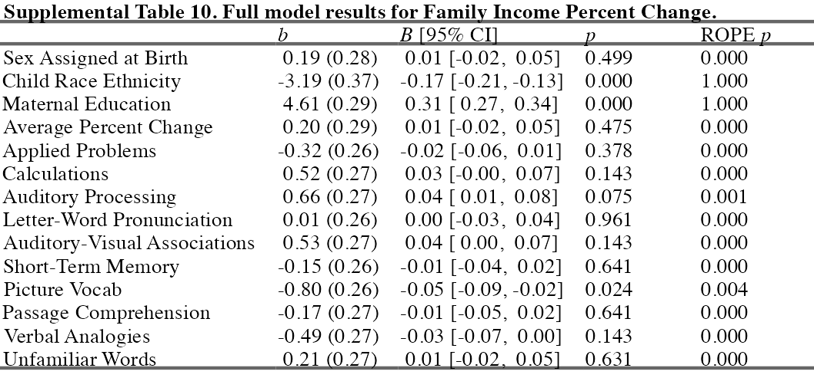
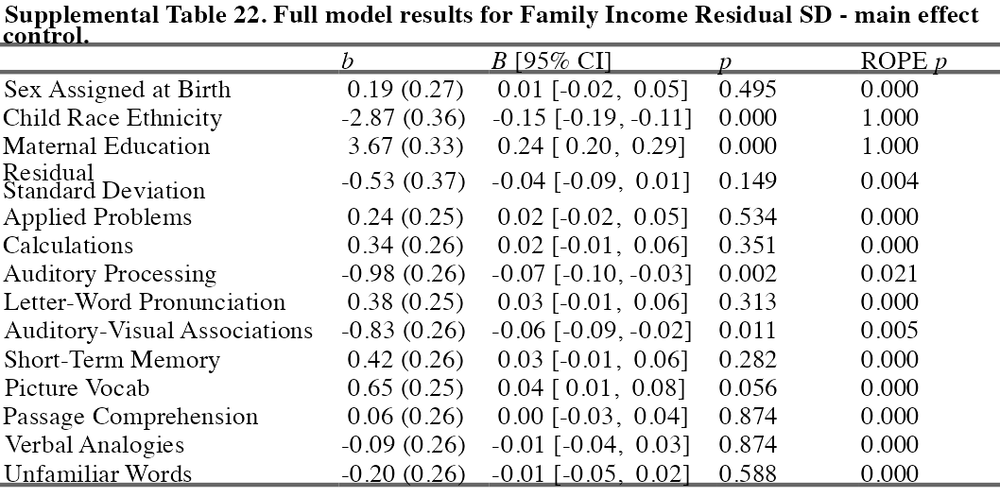

# Supplemental Materials


This document contains seven parts. First, we provide correlations and
descriptive statistics for all indicators used to create aggregate
variables for harshness and unpredictability. Second, we provide full
regression tables for the primary results. Third, we provide full
results for the first set of secondary analyses. Fourth, we provide
figures for both primary and secondary analyses where WJ scores are
uncentered. Note that these analyses are the same, however, centering WJ
scores allows for better visual comparison of each subtest slope. The
uncentered scores retain visual information about mean differences in
performance across subtest types. Fifth, we provide correlations between
WJ subtests over time. Sixth, we provide background and a causal
inference discussion regarding statistical controls. We then use this
discussion to frame the various issues with controlling for average
income in our income variability analyses. Next, we describe our
analytic approach to controlling for average income and provide a figure
of results for the income variability analyses with and without average
income controls. Finally, we provide full regression results for each of
these analyses.

Below are links to each of these sections:

1.  [Correlations Among All Harshness and Unpredictability
    Indicators](#stab1)
2.  **Full Primary Analysis Results**
    - [Family Income Disadvantage](#p1)
    - [Neighborhood Socioeconomic Disadvantage](#p2)
    - [Family Transitions Results](#p3)
    - [Neighborhood Socioeconomic Variability](#p4)
3.  **Full Secondary Analysis Results - Set 1**
    - [Family Income Average Percent Change](#s1a)
    - [Family Income Coefficient of Variation](#s1b)
4.  **Figures with Uncentered WJ Scores**
    - [Primary Analyses](#sfig1)
    - [Secondary Analyses](#sfig2)
5.  [WJ Subtest Correlations Across Time](#srev1)
6.  **Full Secondary Analysis Results - Set 2**
    - [Causal Models of Harshness and Unpredictability](#srev2)
    - [Income Variability Controlling or Average Income](#srev3)
    - [Income Variability with and without controls figure](#srev4)
7.  **Full Income Variability Results (SD and Residual SD)**
    - No controls (original analysis)
      - [Family Income Standard Deviation](#s2a1)
      - [Family Income Residual Standard Deviation](#s2b1)
    - Main Effect Controls
      - [Family Income Standard Deviation](#s2a2)
      - [Family Income Residual Standard Deviation](#s2b2)
    - Main Effect + Simple Effect Controls
      - [Family Income Standard Deviation](#s2a3)
      - [Family Income Residual Standard Deviation](#s2b3)

## Correlations Among All Harshness and Unpredictability Indicators




## Full Family Income Disadvantage Results




## Full Neighborhood Disadvantage Results




## Full Family Transitions Results




## Full Neighborhood Socioeconomic Variability




## Full Average Percent Change






## Full Coefficient of Variation




## Supplemental Figure 1


## Supplemental Figure 2




## WJ Subtest Correlations Across Time


<br/>


<br/>


<br/>


<br/>





<br/>


<br/>


<br/>


<br/>




## Alternative Causal Models of Harshness, Unpredictability, and Cognitive Performance

It is important to realize that the appropriateness of analyzing
multiple adversity dimensions in one model depends on an underlying
causal model (Cinelli et al., 2022; Rohrer, 2018). There are several
possible causal models for how each adversity dimension relates to the
other and to the outcome.

In cases where each adversity dimension is independent (non-causally
related) and each affects the outcome, the only (potential) benefit to
adding each to the same model is estimation precision (see figure
below). For example, imagine income disadvantage and unpredictability do
not cause each other but they both independently affect WJ performance.
Including both in the model may improve model estimation but they would
not change qualitative conclusions of modeling them separately (assuming
each truly affect the outcome).


However, this quickly becomes tricky if each adversity dimension has a
slightly different causal structure. For example, if income disadvantage
causes both unpredictability and WJ performance (i.e., is a confounder),
then estimating the effect of unpredictability requires controlling for
income disadvantage. Yet, estimating the effect of income disadvantage
is biased when controlling for unpredictability because unpredictability
is a mediator for income disadvantage (orange path). Controlling for
mediators eliminates the indirect effect of the variable of interest.
Including both in the model removes bias for one variable but adds it to
the other.


In cases where one adversity dimension affects the other but only one
affects the outcome, adding both to the model decreases estimation
precision. For example, imagine income disadvantage causes
unpredictability (but not WJ performance) and unpredictability affects
WJ performance. Adding income disadvantage to the model will bias the
estimate of unpredictability.


With limited knowledge about the true causal model and the complexity of
our underlying model (e.g., interactions with dummy-coded WJ subtests),
we deemed it wiser to model each adversity dimension one at time
(however, see income variability analyses below).

## Income Variability Analyses Controlling for Average Income

Whether or not controlling for harshness (e.g., average income) will
help remove bias depends on the underlying causal model. Thus, if theory
says harshness causes unpredictability and cognitive performance, then
statistically controlling for average income will remove bias in the
estimate of the effect of income variability. However, there are other
plausible models (see above) that do not situate harshness (e.g.,
average income) as a confound and which, therefore, do not require
including it as a covariate. In our opinion, there is no strong evidence
that harshness is a confound between unpredictability and cognitive
performance. In fact, theoretically and conceptually, the two are often
cast as orthogonal, where environments can be low and high in one or
both, and have independent effects on outcomes.


In addition, a statistical correlation between average income and income
variability does not automatically mean average income is a confound.
Note that both variables – average income and income variability – come
from the same source of information (income-to-needs over time). Their
correlation is more likely an artifact of measurement scale (e.g., a
ratio scale with a meaningful zero) than from a causal association
between harshness and unpredictability.


Our second set of secondary analyses report models using standard
deviation and residual standard deviation in family income. We conduct
two analyses with each. First, we included the main effect of average
family income in the model. Second, we included the interaction between
average family income and WJ subtest category. Importantly, we never
included an interaction between average income and income variability,
like other work has done (e.g., Li et al., 2018). Doing so tests a
different research question: whether or not the effect of average income
depends on income variability (or vice versa). This is not the focus of
the current nor does it appropriately remove bias of average income in
the main effect of unpredictability (if harshness is a confound
according to an underlying causal model). Below is are the formulas that
distinguish each (other controls not shown):

``` r
## No Controls
WJ_performance = income_sd * wj_subtest + (1|id))

## Controlling the main effect
WJ_performance = income_avg + (income_sd * wj_subtest) + (1|id))

## Controlling both the main effect and the simple effect
WJ_performance = (income_avg * wj_subtest) + (income_sd * wj_subtest) + (1|id)
```

  
Controlling for the main effect of average family income adjusts the
main effect of income variability, not each simple effect of WJ subtest
(see Supplemental Figure 3). Our analyses revealed that doing so changes
the overall effect of income standard deviation from a positive (no
control) to a negative effect (with control). This makes more sense when
considering the average family income and neighborhood disadvantage
analyses, which show more harshness exposure is associated with reduced
overall performance. However, when examining the simple effects, the
effect of income variability on auditory visual associations (orange
points and lines) and auditory processing (gray points and lines) are
negative, which are exactly opposite of the average family income
analyses (see Supplemental Figure 3).

In analyses where the 2-way interaction between average family income
and WJ test category are entered, the effect trends the same way as
average income analyses, although all effects are now non-significant
and practically equivalent to the overall effect. This is more in-line
with the harshness analyses. Both of these patterns are essentially the
same when applied to the Residual Standard Deviation version of income
variability.



## Income Variability with and without controls figure


## Full Family Income Standard Deviation Results - no controls




## Full Family Income Standard Deviation Results - main effect control




## Full Family Income Standard Deviation Results - main effect + simple effect control




## Full Family Income Residual Standard Deviation Results - no controls




## Full Family Income Residual Standard Deviation Results - main effect control






## Full Family Income Residual Standard Deviation Results - main effect + simple effect control




# References

<div id="refs" class="references csl-bib-body hanging-indent"
entry-spacing="0" line-spacing="2">

<div id="ref-cinelli2022" class="csl-entry">

Cinelli, C., Forney, A., & Pearl, J. (2022). A Crash Course in Good and
Bad Controls. *Sociological Methods & Research*, 00491241221099552.
<https://doi.org/grwp6n>

</div>

<div id="ref-li2018" class="csl-entry">

Li, Z., Liu, S., Hartman, S., & Belsky, J. (2018). Interactive effects
of early-life income harshness and unpredictability on children’s
socioemotional and academic functioning in kindergarten and adolescence.
*Developmental Psychology*, *54*(11), 2101–2112.
<https://doi.org/gfmd6w>

</div>

<div id="ref-rohrer2018" class="csl-entry">

Rohrer, J. M. (2018). Thinking clearly about correlations and causation:
Graphical causal models for observational data. *Advances in Methods and
Practices in Psychological Science*, *1*(1), 27–42.
<https://doi.org/gcvj3r>

</div>

</div>
