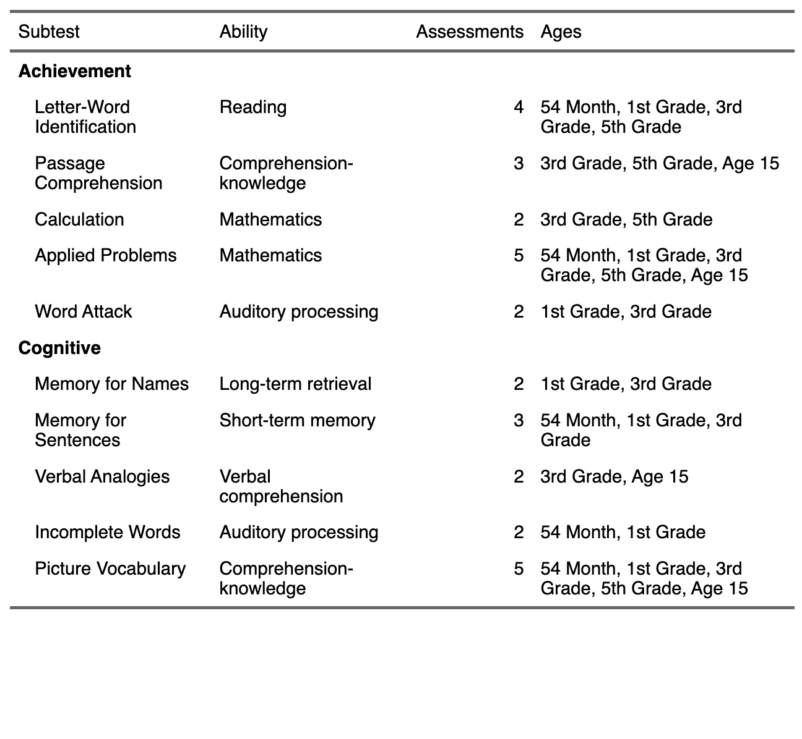
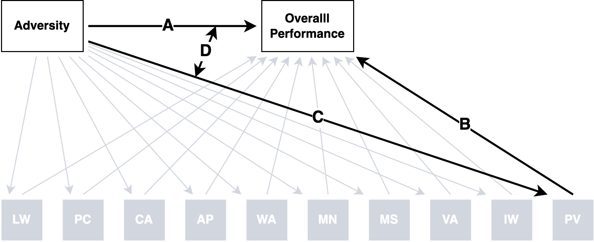

Preregistration
================

*Last updated on Thursday, February 16, 2023 at 03:27 PM*

## Overview

This preregistration document is based on ([Akker et al.,
2021](#ref-akker2021)) for secondary data analyses. There are six parts,
which you can jump to following the links below:

- [Part 1 - Study information](#part-1---study-information)
- [Part 2 - Data Description](#part-2---data-description)
- [Part 3 - Variables](#part-3---variables)
- [Part 4 - Knowledge of Data](#part-4---knowledge-of-data)
- [Part 5 - Analyses](#part-5---analyses)
- [Part 6 - Statement of Integrity](#part-6---statement-of-integrity)

## Part 1 - Study Information

### Q1: Title

“Within-person cognitive performance across abilities among
adversity-exposed people in the SECCYD”

### Q2: Authors

- [Ethan S. Young](https://www.ethan-young.com/)<sup>1</sup>
  [](https://orcid.org/0000-0002-8232-0184)
- Stefan Vermeent<sup>1,
  2</sup>[](https://orcid.org/0000-0002-9595-5373)
- [Willem E.
  Frankenhuis](http://www.willem.maartenfrankenhuis.nl/)<sup>1, 2</sup>
- [Marissa Nivison](https://icd.umn.edu/people/nivis004/)<sup>3</sup>
  [](https://orcid.org/0000-0002-9436-722X)
- [Jeffry
  A.Simpson](https://cla.umn.edu/about/directory/profile/simps108)<sup>3</sup>
  [](https://orcid.org/0000-0003-1899-2493)
- [Glenn I. Roisman](https://icd.umn.edu/people/roism001/)<sup>3</sup>
  [](https://orcid.org/0000-0002-6941-6560)

<sup>1</sup>Utrecht University

<sup>2</sup>Max Planck Institute for the Study of Crime, Security and
Law

<sup>3</sup>University of Minnesota

### Q3: Research Questions

<i>\*Note that some research questions/hypotheses use causal language.
Although we are most interested in these causal questions, the data are
observational. We retain the causal language here but will use
non-causal language when relating any statistical test to these
questions/hypotheses.</i>

**R1:** How does adversity relate to overall performance compared to
subtest performance on large cognitive test batteries? In other words,
how does adversity relate to broad testing scores compared with more
narrow subtest scores?

**R2:** How do impairment and enhancements in cognitive performance
manifest across many cognitive domains?

**R3:** Do different adversity dimensions have similar or different
patterns of effects across broad and narrow cognitive performance
measures?

**R4:** Are the effects of adversity test-specific or test-general?

(Not sure that I want to keep R4 yet)

### Q4: Hypotheses

**H1:** We expect harshness and/or unpredictability to be associated
with a lower overall within-person Woodcock Johnson (WJ) cognitive
ability score (sum coded within-person intercept) .

**H2:** Compared with overall WJ scores, the effect of harshness and/or
unpredictability will vary; some sub-tests will show lowered performance
whereas others remain ‘intact’.

**H3:** If any sub-tests remain intact (or enhanced), they will be tests
that depend less on formal crystallized knowledge and reading ability
(i.e., short term memory, auditory processing, fluid intelligence).

## Part 2 - Data Description

### Q5: Dataset

We will use data from the National Institute of Child Health and
Development (NICHD) Study of Early Childcare and Youth Development
([SECCYD](https://www.icpsr.umich.edu/web/ICPSR/series/00233), [Network,
2005](#ref-nichdearlychildcareresearchnetwork2005)). The SECCYD was
conducted in four waves across multiple sites and designed to be
nationally representative, prospective, longitudinal study. The broad
research goals of the study was to investigate the relation between
childcare and development from infancy through adolescence and into
early adulthood. Families were recruited for the NICHD SECCYD in 1991. A
total of 1364 families met all the prescreening criteria. Below are
detailed descriptions of each study phase:

- [Phase 1
  (1991-1994)](https://www.icpsr.umich.edu/web/ICPSR/studies/21940)
- [Phase 2
  (1995-1999)](https://www.icpsr.umich.edu/web/ICPSR/studies/21941)
- [Phase 3
  (2000-2004)](https://www.icpsr.umich.edu/web/ICPSR/studies/21942)
- [Phase 4
  (2005-2007)](https://www.icpsr.umich.edu/web/ICPSR/studies/22361)

### Q6: Public Availability -

Data are publicly available. However, users must make an account with
ISCPR (see [here](https://www.icpsr.umich.edu/rpxlogin)) anmd must sign
a data use agreement. Users must also provide details about how data
will be used (e.g., project description) and information (e.g., IRB
approval). For each study phase, see more information about data access
under “Access Restricted Data” tab.

### Q7: Data Access

Data can be accessed through the following links.

- [Phase 1
  (1991-1994)](https://www.icpsr.umich.edu/web/ICPSR/studies/21940),
  doi: https://doi.org/10.3886/ICPSR21940.v6
- [Phase 2
  (1995-1999)](https://www.icpsr.umich.edu/web/ICPSR/studies/21941),
  doi: https://doi.org/10.3886/ICPSR21941.v5
- [Phase 3
  (2000-2004)](https://www.icpsr.umich.edu/web/ICPSR/studies/21942),
  doi: https://doi.org/10.3886/ICPSR21942.v6
- [Phase 4
  (2005-2007)](https://www.icpsr.umich.edu/web/ICPSR/studies/22361),
  doi: https://doi.org/10.3886/ICPSR22361.v5

### Q8: Date of Download

- Ethan Young (lead author and data analyst)
  - Accessed data for the dependent variables on February 3rd, 2022
- Stefan Vermeent will not access the data
- Willem Frankenhuis will not access the data
- Marissa Nivison…
- Jeffry Simpson will not access the data
- Glenn Roisman…

### Q9: Data Collection

Detailed information about recruitment, selection procedures, measures,
and study methodology can be found
[online](https://www.icpsr.umich.edu/web/ICPSR/series/00233).

### Q10: Codebooks

Detailed codebooks for each study wave can be downloaded at the
following links:

- [Phase 1
  (1991-1994)](https://www.icpsr.umich.edu/web/ICPSR/studies/21940/datadocumentation)
- [Phase 2
  (1995-1999)](https://www.icpsr.umich.edu/web/ICPSR/studies/21941/datadocumentation)
- [Phase 3
  (2000-2004)](https://www.icpsr.umich.edu/web/ICPSR/studies/21942/datadocumentation)
- [Phase 4
  (2000-2004)](https://www.icpsr.umich.edu/web/ICPSR/studies/22361/datadocumentation)

Once variables for this study are selected, accessed, and ready for
pre-processing/analysis, codebooks will be available
[here](../codebooks/)

## Part 3 - Variables

### Q11: Manipulated Variables:

*NA*

### Q12: Measured Variables

#### Covariates

- Gender
- Ethnicity

#### Independent Variables

Unpredictability

- Residential changes
- Parental transitions
- Job changes

Harshness

- Income-to-needs ratio

#### Dependent Variables

The main dependent measures will come from the Woodcock-Johnson
Cognitive and Achievement Tests ([Woodcock, 1990](#ref-woodcock1990);
[Woodcock et al., 1990](#ref-woodcock1990a)).



##### Scores

For all tests, we will use standard scores. These scores are equivalent
to IQ scores in that they use a mean of 100 and standard deviation of
15. This is useful when comparing many different tests.

##### Aggregation strategy

For each subtest, standard scores will be averaged over time to arrive
at one score per subtest. For example, picture vocabulary was measured
five times so overall picture vocabulary will be averaged over the five
time points.

### Q13: Inclusion/Exclusion criteria

*NOT DONE*

### Q14: Missing data

*NOT DONE*

### Q15: Outliers

*NOT DONE*

### Q16: Sample Weights

**NA**

## Part 4 - Knowledge of Data

*NOT DONE*

### Q17: Relevant Publications

*NOT DONE*

### Q18: Prior Knowledge

*NOT DONE*

## Part 5 - Analyses

### Q19: Hypotheses -\> Statistical Tests

Below is a conceptual depiction of our analyses:

<div id="fig-conceptual">



Figure 1: We are interested in the effect of each adversity measure on a
person’s overall score, measured as a formative average of each subtest.
(A) is the main effect of adversity on overall performance. (B) is the
main effect of a subtest. (C) is the simple effect (slope) of adversity
for a particular subtest. (D) is the interaction effect that measures
the difference between A and C. A significant simple slope means the C ≠
0 and a significant interaction means A ≠ C. So, when C is significant,
it means that adversity affects performance. When D is significant, it
means that adversity affects a subtest in a different way than A
(overall pattern).

</div>

We will use a mixed effects linear regression to test Hypotheses 1 & 2
using the `lmer`. To do so, we proceed in three steps:

1.  We will standardize (z-score) our independent variables. This
    centers the IV at 0 and scales them with standard deviation = 1.

``` r
example_data1 <- 
  seccyd_dvs_wj_data2 |> 
  group_by(id) |> 
  summarize(
    # Average scores over time to single scores for each subtest
    across(starts_with("wj_"), list(mean = ~ mean(.x, na.rm = T), n = ~sum(!is.na(.x))))
  ) |> 
  mutate(across(everything(), ~ifelse(is.nan(.x), NA, .x))) |> 
  select(id, ends_with("mean")) |> 
  mutate(
    id = 1:n(),
    # Make up an adversity variable for the preregistration and standardize (step 1)
    adversity = rnorm(n()) |> scale() |> as.numeric()
  )
```

2.  We then stack the data into ‘long’ format. There are 10 subtests, so
    each participant will have 10 associated rows. Two new columns are
    created, one indicating the subtest type and one indicating each
    participant’s associated score.

Below is an example of one participant’s data:

``` r
example_data2 <- 
  example_data1 |> 
  # Stack data so that eadh participant has one row per subtest score (step 2)
  pivot_longer(c(-id, -adversity), names_to = "wj_sub_test", values_to = "score")

# Show an example of one participants data structure
example_data2 |> 
  filter(id == 1) |> 
  knitr::kable()
```

|  id |  adversity | wj_sub_test   |    score |
|----:|-----------:|:--------------|---------:|
|   1 | -0.3085591 | wj_picvo_mean | 108.7500 |
|   1 | -0.3085591 | wj_vrba_mean  | 139.5000 |
|   1 | -0.3085591 | wj_pscmp_mean | 133.0000 |
|   1 | -0.3085591 | wj_appld_mean | 130.5000 |
|   1 | -0.3085591 | wj_memse_mean | 115.0000 |
|   1 | -0.3085591 | wj_incom_mean | 128.0000 |
|   1 | -0.3085591 | wj_memna_mean | 117.0000 |
|   1 | -0.3085591 | wj_lwid_mean  | 138.6667 |
|   1 | -0.3085591 | wj_wrdat_mean | 134.0000 |
|   1 | -0.3085591 | wj_calc_mean  | 143.0000 |

3.  Next, we apply a sum coded contrast to the subtest index column.
    This means the intercept in the mixed effect model reflects the
    grand mean of all WJ subtest scores. Sum coding allows us to compare
    the effect of adversity on each subtest to the mean of all tests.

For example, the underlying contrasts would look like the following:

``` r
example_data3 <- 
  example_data2 |> 
  mutate(
    # Apply sum contrasts (step 3)
    wj_sub_test = faux::contr_code_sum(wj_sub_test)
  )

# Show the contrast scheme for the mixed model
example_data3 |> 
  pull(wj_sub_test) |> 
  attr("contrasts") |> 
  as.data.frame() |> 
  rownames_to_column(var = "test") |> 
  mutate(
    test = str_replace_all(test,"^wj_(.*)_mean$", "\\1")
  ) |> 
  rename_with(
    .cols = everything(), 
    ~str_replace_all(.x ,"^.wj_(.*)_mean-intercept", "\\1")
  ) |> 
  knitr::kable()
```

| test  | appld | calc | incom | lwid | memna | memse | picvo | pscmp | vrba |
|:------|------:|-----:|------:|-----:|------:|------:|------:|------:|-----:|
| appld |     1 |    0 |     0 |    0 |     0 |     0 |     0 |     0 |    0 |
| calc  |     0 |    1 |     0 |    0 |     0 |     0 |     0 |     0 |    0 |
| incom |     0 |    0 |     1 |    0 |     0 |     0 |     0 |     0 |    0 |
| lwid  |     0 |    0 |     0 |    1 |     0 |     0 |     0 |     0 |    0 |
| memna |     0 |    0 |     0 |    0 |     1 |     0 |     0 |     0 |    0 |
| memse |     0 |    0 |     0 |    0 |     0 |     1 |     0 |     0 |    0 |
| picvo |     0 |    0 |     0 |    0 |     0 |     0 |     1 |     0 |    0 |
| pscmp |     0 |    0 |     0 |    0 |     0 |     0 |     0 |     1 |    0 |
| vrba  |     0 |    0 |     0 |    0 |     0 |     0 |     0 |     0 |    1 |
| wrdat |    -1 |   -1 |    -1 |   -1 |    -1 |    -1 |    -1 |    -1 |   -1 |

4.  We fit a linear mixed effects model with the following terms
    - contrast coded subtest
    - adversity (standardized)
    - interaction between contrast coded subtest and adversity
    - random intercept for participants

``` r
# Fit model
subtest_model <- lmer(score ~ wj_sub_test * adversity + (1|id), data = example_data3)
```

Below is an example of the output from the above analysis:

**Unstandardized Parameters**

``` r
# Standardized and Unstandardized parameters
subtest_model |> 
  parameters::parameters() |> 
  mutate(across(where(is.numeric), ~round(.x, 3))) |> 
  mutate(
    Parameter = str_replace_all(Parameter, "^wj_sub_test.wj_(.*)_mean-intercept","\\1"),
    Parameter = str_replace(Parameter, ":", " * ")
  ) |> 
  filter(Effects == "fixed") |> 
  select(Parameter, Coefficient, SE, p) |> 
  knitr::kable()
```

<div class="cell-output-display">

| Parameter          | Coefficient |    SE |     p |
|:-------------------|------------:|------:|------:|
| (Intercept)        |     105.338 | 0.321 | 0.000 |
| appld              |       2.566 | 0.259 | 0.000 |
| calc               |       6.539 | 0.268 | 0.000 |
| incom              |      -9.196 | 0.266 | 0.000 |
| lwid               |       1.600 | 0.259 | 0.000 |
| memna              |      -0.232 | 0.264 | 0.379 |
| memse              |      -8.310 | 0.260 | 0.000 |
| picvo              |      -2.697 | 0.259 | 0.000 |
| pscmp              |       3.070 | 0.267 | 0.000 |
| vrba               |       5.441 | 0.269 | 0.000 |
| adversity          |       0.416 | 0.321 | 0.196 |
| appld \* adversity |       0.285 | 0.259 | 0.271 |
| calc \* adversity  |       0.188 | 0.267 | 0.481 |
| incom \* adversity |      -0.204 | 0.265 | 0.442 |
| lwid \* adversity  |      -0.211 | 0.259 | 0.415 |
| memna \* adversity |       0.227 | 0.263 | 0.389 |
| memse \* adversity |      -0.023 | 0.260 | 0.931 |
| picvo \* adversity |      -0.579 | 0.259 | 0.025 |
| pscmp \* adversity |       0.126 | 0.266 | 0.637 |
| vrba \* adversity  |       0.421 | 0.268 | 0.117 |

</div>

**Standardized Parameters**

``` r
# Standardized and Unstandardized parameters
subtest_model |> 
  parameters::standardize_parameters() |>
  mutate(across(where(is.numeric), ~round(.x, 3))) |> 
  mutate(
    Parameter = str_replace_all(Parameter, "^wj_sub_test.wj_(.*)_mean-intercept","\\1"),
    Parameter = str_replace(Parameter, ":", " * ")
  ) |> 
  select(-CI) |> 
  knitr::kable()
```

| Parameter          | Std_Coefficient | CI_low | CI_high |
|:-------------------|----------------:|-------:|--------:|
| (Intercept)        |          -0.005 | -0.048 |   0.037 |
| appld              |           0.173 |  0.139 |   0.207 |
| calc               |           0.441 |  0.406 |   0.476 |
| incom              |          -0.620 | -0.655 |  -0.585 |
| lwid               |           0.108 |  0.074 |   0.142 |
| memna              |          -0.016 | -0.051 |   0.019 |
| memse              |          -0.560 | -0.595 |  -0.526 |
| picvo              |          -0.182 | -0.216 |  -0.148 |
| pscmp              |           0.207 |  0.172 |   0.242 |
| vrba               |           0.367 |  0.331 |   0.402 |
| adversity          |           0.028 | -0.014 |   0.071 |
| appld \* adversity |           0.019 | -0.015 |   0.053 |
| calc \* adversity  |           0.013 | -0.023 |   0.048 |
| incom \* adversity |          -0.014 | -0.049 |   0.021 |
| lwid \* adversity  |          -0.014 | -0.049 |   0.020 |
| memna \* adversity |           0.015 | -0.020 |   0.050 |
| memse \* adversity |          -0.002 | -0.036 |   0.033 |
| picvo \* adversity |          -0.039 | -0.073 |  -0.005 |
| pscmp \* adversity |           0.008 | -0.027 |   0.044 |
| vrba \* adversity  |           0.028 | -0.007 |   0.064 |

### Q20: Predicted effect sizes

*NOT DONE*

### Q21: Statistical Power

*NOT DONE*

### Q22: Inferential Criteria

Our inferential criteria will use p \< .05 for interaction effects
between adversity and subtest type and simple effects of adversity for
each subtest.

We interested in three effect sizes:

1.  The main effect of each adversity measure (tested in separate
    models).
2.  The simple effect of adversity for each subtest.
3.  The interaction effect between an adversity measure and subtest.

We are also interested in null effects. Based on prior work, we expect
the main effect of adversity to be negative. However, if main effects
were zero for any adversity measure, we would be interested in
determining if the effect *is* zero by using equivalence testing
([Lakens et al., 2018](#ref-lakens2018)).

For simple effects (effect size 2), we will use simple slopes analysis.
These tests determine whether the simple effect is different from zero.
For these effects, we are interested if they are indeed 0, possibly
using equivalence testing. We are also interested positive slopes of any
size (that are not equivalent to zero).

For negative slopes, we are interested in effects that are different
from the overall main effect of adversity. This is where the interaction
term is important. The interaction effect tests whether the effect of
adversity for a given subtest is different from the main effect of
adversity on overall performance. We are interested in both more
negative and more positive than expected slopes compared to the main
effect.

### Q23: Assumption Violations

If any assumptions are violated, we will update the preregistration
and/or report deviations from the preregistration. However, we do not
anticipate any serious violations.

### Q24: Evaluating Strength, Reliability, and Robustness

If there are arbitrary data processing decisions, we may use multiverse
analysis to systematically explore their effect.

### Q25: Exploratory Analyses

We may or may not do serveral exploratory analyses listed below:

1.  Fit structural equation models to Woodcock Johnson data to examine
    how adversity relates to an overall latent variable and to residual
    test variance in each subtest
2.  Depending on the main results, we may also look at subtest scores
    over time to examine developmental trajectories in those tests.
3.  We may run additional analyses identical to our main analyses but
    with different adversity measures that are not central to our
    framework.

## Part 6 - Statement of Integrity

The authors of this preregistration state that they filled out this
preregistration to the best of their knowledge and that no other
preregistration exists pertaining to the same hypotheses and dataset.

## References

<div id="refs" class="references csl-bib-body hanging-indent"
line-spacing="2">

<div id="ref-akker2021" class="csl-entry">

Akker, O. R. van den, Weston, S., Campbell, L., Chopik, B., Damian, R.,
Davis-Kean, P., Hall, A., Kosie, J., Kruse, E., Olsen, J., Ritchie, S.,
Valentine, K. D., Veer, A. van ’t, & Bakker, M. (2021). Preregistration
of secondary data analysis: A template and tutorial. *Meta-Psychology*,
*5*. <https://doi.org/10.15626/MP.2020.2625>

</div>

<div id="ref-lakens2018" class="csl-entry">

Lakens, D., Scheel, A. M., & Isager, P. M. (2018). Equivalence Testing
for Psychological Research: A Tutorial. *Advances in Methods and
Practices in Psychological Science*, *1*(2), 259–269.
<https://doi.org/10.1177/2515245918770963>

</div>

<div id="ref-nichdearlychildcareresearchnetwork2005" class="csl-entry">

Network, N. E. C. C. R. (2005). *Child care and child development:
Results from the NICHD study of early child care and youth development*
(pp. xx, 474). The Guilford Press.

</div>

<div id="ref-woodcock1990" class="csl-entry">

Woodcock, R. W. (1990). Theoretical Foundations of the Wj-R Measures of
Cognitive Ability. *Journal of Psychoeducational Assessment*, *8*(3),
231–258. <https://doi.org/ft7mjn>

</div>

<div id="ref-woodcock1990a" class="csl-entry">

Woodcock, R. W., Johnson, M. B., & Mather, N. (1990). *Woodcock-Johnson
psycho-educational battery– revised*. DLM Teaching Resources.

</div>

</div>
