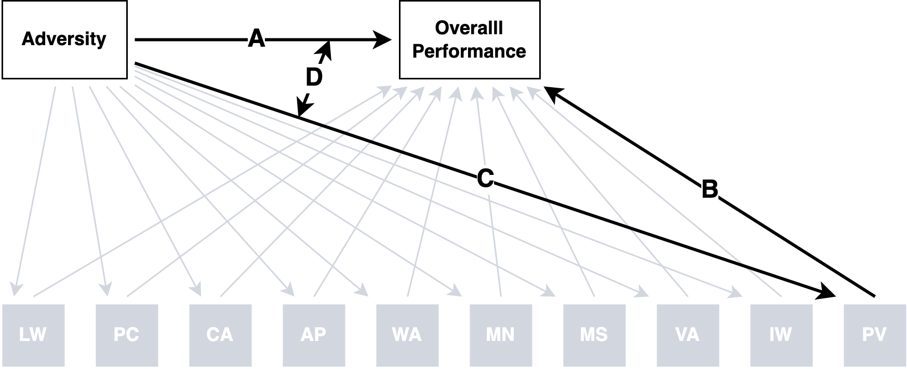

Preregistration
================

*Last updated on Friday, April 14, 2023 at 06:09 PM*

## Overview

This preregistration document is based on ([Akker et al.,
2021](#ref-akker2021)) for secondary data analyses. There are six parts,
which you can jump to following the links below:

- [Part 1 - Study information](#part-1---study-information)
- [Part 2 - Data Description](#part-2---data-description)
- [Part 3 - Variables](#part-3---variables)
- [Part 4 - Knowledge of Data](#part-4---knowledge-of-data)
- [Part 5 - Analyses](#part-5---analyses)
- [Part 6 - Statement of Integrity](#part-6---statement-of-integrity)

## Part 1 - Study Information

### Q1: Title

“Within-person cognitive performance across abilities among
adversity-exposed people in the SECCYD”

### Q2: Authors

- [Ethan S. Young](https://www.ethan-young.com/)<sup>1</sup>
  [](https://orcid.org/0000-0002-8232-0184)
- [Stefan Vermeent](https://www.stefan-vermeent.nl)<sup>1,
  2</sup>[](https://orcid.org/0000-0002-9595-5373)
- [Willem E.
  Frankenhuis](http://www.willem.maartenfrankenhuis.nl/)<sup>1, 2</sup>
- [Marissa Nivison](https://icd.umn.edu/people/nivis004/)<sup>3</sup>
  [](https://orcid.org/0000-0002-9436-722X)
- [Jeffry
  A.Simpson](https://cla.umn.edu/about/directory/profile/simps108)<sup>3</sup>
  [](https://orcid.org/0000-0003-1899-2493)
- [Glenn I. Roisman](https://icd.umn.edu/people/roism001/)<sup>3</sup>
  [](https://orcid.org/0000-0002-6941-6560)

<sup>1</sup>Utrecht University

<sup>2</sup>Max Planck Institute for the Study of Crime, Security and
Law

<sup>3</sup>University of Minnesota

### Q3: Research Questions

<i>\*Note that some research questions/hypotheses use causal language.
Although we are most interested in these causal questions, the data are
observational. We retain the causal language here but will use
non-causal language when relating any statistical test to these
questions/hypotheses.</i>

**R1:** How does adversity relate to overall performance compared to
subtest performance on large cognitive test batteries? In other words,
how does adversity relate to broad testing scores compared with more
narrow, specific subtest scores?

**R2:** How do impairments and enhancements in cognitive performance
manifest across many cognitive domains?

**R3:** Do different adversity dimensions have similar or different
patterns of effects across broad and narrow cognitive performance
measures?

**R4:** Are the effects of adversity test-specific or test-general?

### Q4: Hypotheses

**H1:** We expect harshness and/or unpredictability to be associated
with lower overall within-person Woodcock Johnson (WJ) cognitive ability
score (sum coded within-person intercept).

**H2:** Compared with overall WJ scores, the effect of harshness and/or
unpredictability on specific sub-tests will vary; some sub-tests will
show lowered performance, whereas others will remain ‘intact’ (i.e.,
should little if any change) or even show enhanced performance.

**H3:** If any sub-tests remain intact (or enhanced), they will be tests
that depend less on formal crystallized knowledge and reading ability
(i.e., short term memory, auditory processing, fluid intelligence).

*\<\< – SV: I don’t see these hypotheses in the introduction, especially
H3 which seems way more specific than the types of ‘principled
exploratory’ steps that you describe there. Is this with a reason? Do we
have enough existing evidence to predict H3 and if so, should that be
something that features in the intro? – \>\>*

## Part 2 - Data Description

### Q5: Dataset

We will use data from the National Institute of Child Health and
Development (NICHD) Study of Early Childcare and Youth Development
\[[SECCYD](https://www.icpsr.umich.edu/web/ICPSR/series/00233); Network
([2005](#ref-nichdearlychildcareresearchnetwork2005))\]. The SECCYD is a
prospective, longitudinal study conducted in four waves across multiple
sites. The broad research goals of the study was to investigate the
relation between childcare and development from infancy through
adolescence and into early adulthood. Families were recruited for the
NICHD SECCYD in 1991. A total of 1364 families met all the prescreening
criteria. Below are detailed descriptions of each study phase:

- [Phase 1
  (1991-1994)](https://www.icpsr.umich.edu/web/ICPSR/studies/21940)
- [Phase 2
  (1995-1999)](https://www.icpsr.umich.edu/web/ICPSR/studies/21941)
- [Phase 3
  (2000-2004)](https://www.icpsr.umich.edu/web/ICPSR/studies/21942)
- [Phase 4
  (2005-2007)](https://www.icpsr.umich.edu/web/ICPSR/studies/22361)

### Q6: Public Availability

Data are publicly available through age 15 years. However, users must
make an account with ISCPR (see
[here](https://www.icpsr.umich.edu/rpxlogin)) and must sign a data use
agreement. Users must also provide details about how data will be used
(e.g., project description) and information (e.g., IRB approval). For
each study phase, see more information about data access under “Access
Restricted Data” tab.

### Q7: Data Access

Data can be accessed through the following links.

- [Phase 1
  (1991-1994)](https://www.icpsr.umich.edu/web/ICPSR/studies/21940),
  doi: https://doi.org/10.3886/ICPSR21940.v6
- [Phase 2
  (1995-1999)](https://www.icpsr.umich.edu/web/ICPSR/studies/21941),
  doi: https://doi.org/10.3886/ICPSR21941.v5
- [Phase 3
  (2000-2004)](https://www.icpsr.umich.edu/web/ICPSR/studies/21942),
  doi: https://doi.org/10.3886/ICPSR21942.v6
- [Phase 4
  (2005-2007)](https://www.icpsr.umich.edu/web/ICPSR/studies/22361),
  doi: https://doi.org/10.3886/ICPSR22361.v5

### Q8: Date of Download

- Ethan Young (lead author and data analyst)
- Accessed data for the dependent variables on February 3rd, 2022
- Accessed data for the independent variables on March 2nd, 2023
- Stefan Vermeent will not access the data
- Willem Frankenhuis will not access the data
- Marissa Nivison has access to the full dataset
- Jeffry Simpson will not access the data
- Glenn Roisman has access to the full data set

### Q9: Data Collection

Detailed information about recruitment, selection procedures, measures,
and study methodology can be found
[online](https://www.icpsr.umich.edu/web/ICPSR/series/00233).

### Q10: Codebooks

Detailed codebooks for each study wave can be downloaded at the
following links:

- [Phase 1
  (1991-1994)](https://www.icpsr.umich.edu/web/ICPSR/studies/21940/datadocumentation)
- [Phase 2
  (1995-1999)](https://www.icpsr.umich.edu/web/ICPSR/studies/21941/datadocumentation)
- [Phase 3
  (2000-2004)](https://www.icpsr.umich.edu/web/ICPSR/studies/21942/datadocumentation)
- [Phase 4
  (2000-2004)](https://www.icpsr.umich.edu/web/ICPSR/studies/22361/datadocumentation)

Once variables for this study are selected, accessed, and ready for
pre-processing/analysis, codebooks will be available
[here](../codebooks/)

## Part 3 - Variables

### Q11: Manipulated Variables:

**Not applicable**

### Q12: Measured Variables

#### Covariates

- Gender
- Race/Ethnicity (White/non-Hispanic = 0, otherwise = 1)
- Maternal education
- 1 = less than high school
- 2 = high school or general education diploma
- 3 = some college or vocational degree
- 4 = college degree
- 5 = some graduate school or master’s degree
- 6 = graduate degree greater than a master’s degree

#### Independent Variables

We are interested in two constructs: environmental harshness and
unpredictability. However, in the literature, and in these data
specifically, there have been different approaches to measuring them.
There are also other, unexplored ways to capture them. Given the
exploratory nature of our approach, we plan to compute both and explore
their effects.

**Unpredictability, Past Approaches**

1.  *Environmental Unpredictability*

This measure is based on Belsky et al. ([2012](#ref-belsky2012)) and
includes three variables that are standardized and averaged together
over the relevant time period:

- Residential changes, or changes in address.
- Paternal transitions, or changes in father figures moving in or out of
  the home.
- Job changes, or changes in employment status for mothers and partners.

2.  *Income Variation*

This measure is based on Li et al. ([2018](#ref-li2018)) and computes
the residual variance in income-to-needs ratios after a linear trend is
fit to each participant.

**Harshness, Past Approaches**

Studies based on both the Belsky et al. ([2012](#ref-belsky2012)) and Li
et al. ([2018](#ref-li2018)) approaches have used income-to-needs ratio.
In most cases, an average score over the relevant period is the measure.
However, some use an intercept after fitting a linear model to each
person’s income data.

**The Current approach**

In addition to these classic measures, we plan to leverage data from the
Census about the broader ecological context. Addresses were tracked for
each participant over time. These addresses were geocoded and linked to
the 1990 and 2000 decinniel Census blocks. Census blocks are the
smallest geographical area that the Census measures. We will only use
the 1990 Census blocks because all IVs in this study will be from when
target participants were 0 - 54 months old.

The Census variables relevant here are the following:

- Percent of people living under the poverty line
- Median household income
- Gini coefficient, a metric for measuring income inequality
- Percent of unemployed individuals over 16 in the workforce
- Percent of occupied houses that are occupied by renters

We plan to compute mean and standard deviation scores for each Census
measure over the addresses each participant lived at. For an overall
neighborhood harshness score, we will standardize and average together
each mean score. For an overall neighborhood change score, we will
standardize and average together all standard deviation scores.

**Summary**

In short, we plan to analyze the following variables:

*Harshness*

- Census based neighborhood harshness (from census variable averages)
- Average income-to-needs

*Unpredictability*

- Classic composite from Belsky et al. ([2012](#ref-belsky2012))
- Census-based neighborhood change (from standard deviations)
- Standard deviation of income-to-needs (this is a deviation from Li et
  al. ([2018](#ref-li2018)))

**Possible follow-ups**

We might break apart composites. For example, we may analyze Census
variables separately or items from the classic unpredictability measure.
If we do so, these analyses will be reported in a supplement, only. We
may mention them in the main text, but they will not be interpreted to
the same degree as the main analyses.

**Other possible (exploratory) variables:**

- Maternal depression
- Variability in maternal depression

#### Dependent Variables

The main dependent measures will come from the Woodcock-Johnson
Cognitive and Achievement Tests ([Woodcock, 1990](#ref-woodcock1990);
[Woodcock et al., 1990](#ref-woodcock1990a)).


**Scores**

For all tests, we will use standard scores. These scores are equivalent
to IQ scores in that they use a mean of 100 and standard deviation of
15. This is useful when comparing many different tests.

**Aggregation strategy**

For each subtest, standard scores will be averaged over time to arrive
at one score per subtest. For example, picture vocabulary was measured
five times so overall picture vocabulary will be averaged over the five
time points.

*\<\< – SV: Do you think it’s necessary to control for age within these
time points before aggregating? I assume the gap between the first and
fifth timepoint is quite wide? – \>\>*

### Q13: Inclusion/Exclusion criteria

At the time of writing this preregistration, the only inclusion criteria
are that participants should have a least one non-missing score on each
subtest for at least one measurement period. This ensures that every
case has at least one assessment of each subtest included in their
overall average of all subtests. Participants must also have at least
one score for the adversity measure. Each adversity measure will be
analyzed in a separate model so the total samples size for each
adversity measure may differ depending on missing data patterns (see
Q14).

If it becomes clear that there are other inclusion/exclusion criteria,
we will update the preregistration and/or report deviations in the final
manuscript. If there are many reasonable alternative criteria, we may
use multiverse analysis to handle all combinations of reasonable and
arbitrary inclusion/exclusion criteria.

### Q14: Missing data

Below are missing data rates arcoss key variables.

#### Dependent Variables

``` r
dvs_analysis_long |> 
  summarize(
    n = n(),
    n_prop = (n/1364) * 100,
    .by = c(wj_subtest, n_missing)
  ) |> 
  mutate(
    n = str_pad(sprintf("%.0f", n), side = "left", 4),
    n_prop =  str_pad(paste0("(", sprintf("%.2f", n_prop), "%)"), side = "left", 8),
    missingness = glue::glue("{n} {n_prop}")
  ) |> 
  select(wj_subtest, n_missing, missingness) |> 
  pivot_longer(c(-wj_subtest, -n_missing), names_to = "type") |> 
  unite(type, n_missing, col = "type") |> 
  pivot_wider(names_from = "type", values_from = "value") |> 
  mutate(wj_subtest = factor(wj_subtest, wj_order, wj_labels)) |> 
  mutate(across(starts_with("miss"), ~ifelse(is.na(.x), "", .x))) |> 
  select(
    wj_subtest, 
    missingness_0, 
    missingness_1,
    missingness_2,
    missingness_3,
    missingness_4, 
    missingness_5
  ) |> 
  knitr::kable(
    col.names = c("WJ Subtest", paste("Missing", c(0:5), "Assessments") |> str_replace("1 Assessments","1 Assessment"))
  )
```

| WJ Subtest                   | Missing 0 Assessments | Missing 1 Assessment | Missing 2 Assessments | Missing 3 Assessments | Missing 4 Assessments | Missing 5 Assessments |
|:-----------------------------|:----------------------|:---------------------|:----------------------|:----------------------|:----------------------|:----------------------|
| Picture Vocab                | 746 (54.69%)          | 189 (13.86%)         | 95 (6.96%)            | 78 (5.72%)            | 48 (3.52%)            |                       |
| Verbal Analogies             | 840 (61.58%)          | 224 (16.42%)         | 92 (6.74%)            |                       |                       |                       |
| Passage Comprehension        | 803 (58.87%)          | 203 (14.88%)         | 74 (5.43%)            | 76 (5.57%)            |                       |                       |
| Applied Problems             | 744 (54.55%)          | 189 (13.86%)         | 96 (7.04%)            | 79 (5.79%)            | 47 (3.45%)            | 1 (0.07%)             |
| Short-Term Memory            | 897 (65.76%)          | 149 (10.92%)         | 96 (7.04%)            | 14 (1.03%)            |                       |                       |
| Auditory Processing          | 976 (71.55%)          | 116 (8.50%)          | 64 (4.69%)            |                       |                       |                       |
| Auditory-Visual Associations | 932 (68.33%)          | 171 (12.54%)         | 53 (3.89%)            |                       |                       |                       |
| Syymbolic Learning           | 847 (62.10%)          | 140 (10.26%)         | 113 (8.28%)           | 54 (3.96%)            | 2 (0.15%)             |                       |
| Unfamilar Words              | 932 (68.33%)          | 171 (12.54%)         | 53 (3.89%)            |                       |                       |                       |
| Calculations                 | 926 (67.89%)          | 149 (10.92%)         | 81 (5.94%)            |                       |                       |                       |

#### Independent Variables

**Family Level Variables**

``` r
ivs_partner_transitions |> 
  left_join(ivs_incnt, by = "id") |> 
  left_join(ivs_madep, by = "id") |> 
  select(id, ends_with("na")) |> 
  pivot_longer(c(-id), names_to = "variable", values_to = "n_missing") |> 
  summarize(
    n = n(),
    n_prop = (n/1364) * 100,
    .by = c(variable, n_missing)
  ) |> 
  mutate(
    n = str_pad(sprintf("%.0f", n), side = "left", 4),
    n_prop =  str_pad(paste0("(", sprintf("%.2f", n_prop), "%)"), side = "left", 8),
    missingness = glue::glue("{n} {n_prop}")
  ) |> 
  select(variable, n_missing, missingness) |> 
  pivot_longer(c(-variable, -n_missing), names_to = "type") |> 
  mutate(variable = str_remove(variable, "_na$")) |> 
  unite(variable, type, col = "type") |> 
  pivot_wider(names_from = "type", values_from = "value") |> 
  arrange(n_missing) |> 
  mutate(across(everything(), ~ifelse(is.na(.x), "", .x))) |> 
  knitr::kable(
    col.names = c("Missing Assessments", "Partner Changes", "Mother Job Changes", "Father Job Changes", "Income-to-Needs", "Maternal Depr.")
  )
```

| Missing Assessments | Partner Changes | Mother Job Changes | Father Job Changes | Income-to-Needs | Maternal Depr. |
|--------------------:|:----------------|:-------------------|:-------------------|:----------------|:---------------|
|                   0 |                 |                    |                    | 963 (70.60%)    | 1048 (76.83%)  |
|                   1 | 859 (62.98%)    | 854 (62.61%)       | 631 (46.26%)       | 197 (14.44%)    | 162 (11.88%)   |
|                   2 | 60 (4.40%)      | 96 (7.04%)         | 61 (4.47%)         | 52 (3.81%)      | 52 (3.81%)     |
|                   3 | 144 (10.56%)    | 119 (8.72%)        | 132 (9.68%)        | 44 (3.23%)      | 101 (7.40%)    |
|                   4 | 35 (2.57%)      | 34 (2.49%)         | 32 (2.35%)         | 43 (3.15%)      | 1 (0.07%)      |
|                   5 | 53 (3.89%)      | 50 (3.67%)         | 56 (4.11%)         | 56 (4.11%)      |                |
|                   6 | 23 (1.69%)      | 21 (1.54%)         | 27 (1.98%)         | 9 (0.66%)       |                |
|                   7 | 20 (1.47%)      | 25 (1.83%)         | 31 (2.27%)         |                 |                |
|                   8 | 11 (0.81%)      | 15 (1.10%)         | 18 (1.32%)         |                 |                |
|                   9 | 15 (1.10%)      | 7 (0.51%)          | 28 (2.05%)         |                 |                |
|                  10 | 19 (1.39%)      | 20 (1.47%)         | 25 (1.83%)         |                 |                |
|                  11 | 12 (0.88%)      | 11 (0.81%)         | 21 (1.54%)         |                 |                |
|                  12 | 8 (0.59%)       | 8 (0.59%)          | 27 (1.98%)         |                 |                |
|                  13 | 16 (1.17%)      | 19 (1.39%)         | 28 (2.05%)         |                 |                |
|                  14 | 14 (1.03%)      | 11 (0.81%)         | 26 (1.91%)         |                 |                |
|                  15 | 17 (1.25%)      | 17 (1.25%)         | 26 (1.91%)         |                 |                |
|                  16 | 35 (2.57%)      | 34 (2.49%)         | 60 (4.40%)         |                 |                |
|                  17 | 23 (1.69%)      | 23 (1.69%)         | 135 (9.90%)        |                 |                |

### Q15: Outliers

Our strategy will be to retain outliers. However, if we discover
influential outliers, we may use a multiverse strategy to handle how
they affect analyses.

### Q16: Sample Weights

**Not applicable**

## Part 4 - Knowledge of Data

### Q17: Relevant Publications

**No author has analyzed or worked with the Woodcock Johnson subtest
scores prior to this preregistration.**

EY has not published any papers using this dataset. In 2014 and 2015,
EY, JS, and GI submitted a paper to *Child Development* (rejected) and
*Development and Psychopathology* (withdrawn). The paper used aggregated
Woodcock Johnson scores over each assessment and used income-to-needs as
a covariate.

MN has intimate knowledge of this dataset. MN has published two papers
using the dataset. MN also has one manuscript in press and one under
review using the data. MN has not analyzed or used the subtest variables
in the current preregistration.

GI has intimate knowledge of this dataset. GI is a co-principal
investigator on the project and has published many papers using the
data. Variables analyzed in GI publications relate mostly to the
dependent variables in this project. Those relevant to the current
preregistration include:

- Bleil et al. ([2021](#ref-bleil2021))
- Cottrell et al. ([2015](#ref-cottrell2015))
- Monti et al. ([2014](#ref-monti2014))
- Fraley et al. ([2013](#ref-fraley2013))
- Roisman et al. ([2012](#ref-roisman2012))
- Burt & Roisman ([2010](#ref-burt2010))

JS has also worked with the current dataset. Variables in JS
publications relate mostly to the independent variables used in this
study. Those relevant to the current preregistration include:

- Hartman et al. ([2018](#ref-hartman2018a))
- Sung et al. ([2016](#ref-sung2016))

SV and WF have no prior experience with the data.

### Q18: Prior Knowledge

From prior work, we have some knowledge of how income, maternal
education, and quality of maternal caregiving (observations of maternal
sensitivity) are associated with aggregated Woodcock Johnson scores. For
example, Fraley et al. ([2013](#ref-fraley2013)) find correlations
between Woodcock Johnson composites over 5 assessment periods and
income-to-needs (averaged over 6, 15, 24, and 36 months; *rs* range =
.34-.37), maternal education (*rs* range = .41 - .47), and maternal
sensitivity (*rs* range = .40 - .47) . These findings give us a strong
prior that harshness/poverty will be associated with a lower within
person average Woodcock Johnson score.

## Part 5 - Analyses

### Q19: Hypotheses -\> Statistical Tests

Below is a conceptual depiction of our analyses:

<div id="fig-conceptual">



Figure 1: We are interested in the effect of each adversity measure on a
person’s overall score, measured as a formative average of each subtest.
(A) is the main effect of adversity on overall performance. (B) is the
main effect of a subtest. (C) is the simple effect (slope) of adversity
for a particular subtest. (D) is the interaction effect that measures
the difference between A and C. A significant simple slope means the C ≠
0 and a significant interaction means A ≠ C. So, when C is significant,
it means that adversity affects performance. When D is significant, it
means that adversity affects a subtest in a different way than A
(overall pattern).

</div>

We will use a mixed effects linear regression to test Hypotheses 1 & 2
using the `lmer` package. To do so, we proceed in three steps:

1.  We will standardize (z-score) our independent variables. This
    centers the IV at 0 and scales them with standard deviation = 1.

``` r
example_data1 <- 
  seccyd_dvs_wj_data2 |> 
  group_by(id) |> 
  summarize(
    # Average scores over time to single scores for each subtest
    across(starts_with("wj_"), list(mean = ~ mean(.x, na.rm = T), n = ~sum(!is.na(.x))))
  ) |> 
  mutate(across(everything(), ~ifelse(is.nan(.x), NA, .x))) |> 
  select(id, ends_with("mean")) |> 
  mutate(
    id = 1:n(),
    # Make up an adversity variable for the preregistration and standardize (step 1)
    adversity = rnorm(n()) |> scale() |> as.numeric()
  )
```

2.  We then stack the data into ‘long’ format. There are 10 subtests, so
    each participant will have 10 associated rows. Two new columns are
    created, one indicating the subtest type and one indicating each
    participant’s associated score.

Below is an example of one participant’s data:

``` r
example_data2 <- 
  example_data1 |> 
  # Stack data so that eadh participant has one row per subtest score (step 2)
  pivot_longer(c(-id, -adversity), names_to = "wj_sub_test", values_to = "score")

# Show an example of one participants data structure
example_data2 |> 
  filter(id == 1) |> 
  knitr::kable()
```

|  id | adversity | wj_sub_test   |    score |
|----:|----------:|:--------------|---------:|
|   1 | -1.367574 | wj_picvo_mean | 108.7500 |
|   1 | -1.367574 | wj_vrba_mean  | 139.5000 |
|   1 | -1.367574 | wj_pscmp_mean | 133.0000 |
|   1 | -1.367574 | wj_appld_mean | 130.5000 |
|   1 | -1.367574 | wj_memse_mean | 115.0000 |
|   1 | -1.367574 | wj_incom_mean | 128.0000 |
|   1 | -1.367574 | wj_memna_mean | 117.0000 |
|   1 | -1.367574 | wj_lwid_mean  | 138.6667 |
|   1 | -1.367574 | wj_wrdat_mean | 134.0000 |
|   1 | -1.367574 | wj_calc_mean  | 143.0000 |

3.  Next, we apply a sum coded contrast to the subtest index column.
    This means the intercept in the mixed effect model reflects the
    grand mean of all WJ subtest scores. Sum coding allows us to compare
    the effect of adversity on each subtest to the mean of all tests.

For example, the underlying contrasts would look like the following:

``` r
example_data3 <- 
  example_data2 |> 
  mutate(
    # Apply sum contrasts (step 3)
    wj_sub_test = faux::contr_code_sum(wj_sub_test)
  )

# Show the contrast scheme for the mixed model
example_data3 |> 
  pull(wj_sub_test) |> 
  attr("contrasts") |> 
  as.data.frame() |> 
  rownames_to_column(var = "test") |> 
  mutate(
    test = str_replace_all(test,"^wj_(.*)_mean$", "\\1")
  ) |> 
  rename_with(
    .cols = everything(), 
    ~str_replace_all(.x ,"^.wj_(.*)_mean-intercept", "\\1")
  ) |> 
  knitr::kable()
```

| test  | appld | calc | incom | lwid | memna | memse | picvo | pscmp | vrba |
|:------|------:|-----:|------:|-----:|------:|------:|------:|------:|-----:|
| appld |     1 |    0 |     0 |    0 |     0 |     0 |     0 |     0 |    0 |
| calc  |     0 |    1 |     0 |    0 |     0 |     0 |     0 |     0 |    0 |
| incom |     0 |    0 |     1 |    0 |     0 |     0 |     0 |     0 |    0 |
| lwid  |     0 |    0 |     0 |    1 |     0 |     0 |     0 |     0 |    0 |
| memna |     0 |    0 |     0 |    0 |     1 |     0 |     0 |     0 |    0 |
| memse |     0 |    0 |     0 |    0 |     0 |     1 |     0 |     0 |    0 |
| picvo |     0 |    0 |     0 |    0 |     0 |     0 |     1 |     0 |    0 |
| pscmp |     0 |    0 |     0 |    0 |     0 |     0 |     0 |     1 |    0 |
| vrba  |     0 |    0 |     0 |    0 |     0 |     0 |     0 |     0 |    1 |
| wrdat |    -1 |   -1 |    -1 |   -1 |    -1 |    -1 |    -1 |    -1 |   -1 |

4.  We fit a linear mixed effects model with the following terms

- contrast coded subtest
- adversity (standardized)
- interaction between contrast coded subtest and adversity
- random intercept for participants

``` r
# Fit model
subtest_model <- lmer(score ~ wj_sub_test * adversity + (1|id), data = example_data3)
```

Below is an example of the output from the above analysis:

**Unstandardized Parameters**

``` r
# Standardized and Unstandardized parameters
subtest_model |> 
  parameters::parameters() |> 
  mutate(across(where(is.numeric), ~round(.x, 3))) |> 
  mutate(
    Parameter = str_replace_all(Parameter, "^wj_sub_test.wj_(.*)_mean-intercept","\\1"),
    Parameter = str_replace(Parameter, ":", " * ")
  ) |> 
  filter(Effects == "fixed") |> 
  select(Parameter, Coefficient, SE, p) |> 
  knitr::kable()
```

<div class="cell-output-display">

| Parameter          | Coefficient |    SE |     p |
|:-------------------|------------:|------:|------:|
| (Intercept)        |     105.338 | 0.322 | 0.000 |
| appld              |       2.566 | 0.259 | 0.000 |
| calc               |       6.539 | 0.267 | 0.000 |
| incom              |      -9.196 | 0.266 | 0.000 |
| lwid               |       1.600 | 0.259 | 0.000 |
| memna              |      -0.227 | 0.264 | 0.390 |
| memse              |      -8.312 | 0.260 | 0.000 |
| picvo              |      -2.697 | 0.259 | 0.000 |
| pscmp              |       3.069 | 0.267 | 0.000 |
| vrba               |       5.438 | 0.269 | 0.000 |
| adversity          |       0.186 | 0.322 | 0.564 |
| appld \* adversity |      -0.307 | 0.259 | 0.235 |
| calc \* adversity  |       0.521 | 0.266 | 0.050 |
| incom \* adversity |      -0.108 | 0.267 | 0.685 |
| lwid \* adversity  |       0.349 | 0.259 | 0.178 |
| memna \* adversity |       0.209 | 0.265 | 0.431 |
| memse \* adversity |      -0.231 | 0.261 | 0.376 |
| picvo \* adversity |       0.214 | 0.259 | 0.409 |
| pscmp \* adversity |      -0.092 | 0.266 | 0.728 |
| vrba \* adversity  |      -0.821 | 0.268 | 0.002 |

</div>

**Standardized Parameters**

``` r
# Standardized and Unstandardized parameters
subtest_model |> 
  parameters::standardize_parameters() |>
  mutate(across(where(is.numeric), ~round(.x, 3))) |> 
  mutate(
    Parameter = str_replace_all(Parameter, "^wj_sub_test.wj_(.*)_mean-intercept","\\1"),
    Parameter = str_replace(Parameter, ":", " * ")
  ) |> 
  select(-CI) |> 
  knitr::kable()
```

| Parameter          | Std_Coefficient | CI_low | CI_high |
|:-------------------|----------------:|-------:|--------:|
| (Intercept)        |          -0.005 | -0.048 |   0.037 |
| appld              |           0.173 |  0.139 |   0.207 |
| calc               |           0.441 |  0.405 |   0.476 |
| incom              |          -0.620 | -0.655 |  -0.585 |
| lwid               |           0.108 |  0.074 |   0.142 |
| memna              |          -0.015 | -0.050 |   0.020 |
| memse              |          -0.560 | -0.595 |  -0.526 |
| picvo              |          -0.182 | -0.216 |  -0.148 |
| pscmp              |           0.207 |  0.172 |   0.242 |
| vrba               |           0.367 |  0.331 |   0.402 |
| adversity          |           0.013 | -0.030 |   0.055 |
| appld \* adversity |          -0.021 | -0.055 |   0.013 |
| calc \* adversity  |           0.035 |  0.000 |   0.070 |
| incom \* adversity |          -0.007 | -0.043 |   0.028 |
| lwid \* adversity  |           0.024 | -0.011 |   0.058 |
| memna \* adversity |           0.014 | -0.021 |   0.049 |
| memse \* adversity |          -0.016 | -0.050 |   0.019 |
| picvo \* adversity |           0.014 | -0.020 |   0.049 |
| pscmp \* adversity |          -0.006 | -0.041 |   0.029 |
| vrba \* adversity  |          -0.055 | -0.091 |  -0.020 |

### Q20: Predicted effect sizes

We do not have specific predictions for effect sizes but we deem
standardized regression coefficients for interaction effects = .10 (or
higher) and -.10 (or lower) meaningful. These effects would indicate
that an effect of adversity on a subtest score is meaningfully more
negative or more positive.

Effects between -.10 and .10 are not of interest for determining
differences between subtests and the overall average. However, we are
interested in determining if simple effects falling between -.10 and .10
are consitent with an effect of 0. For this scenario, we will use
equivalence testing with -.10 and .10 as bounds.

### Q21: Statistical Power

See our full power analysis [here](power-analysis/) and the code
[here](../scripts/prereg-power-simulation.R).

In short, we used a simulation approach to conduct power analyses. We
simulated adversity scores but used actual Woodcock Johnson test scores.
Simulations revealed, that, with a sample size of (*N* = 1156), the
smallest interaction effect we can detect is $\beta$ = -.075 (or .075)
with 90% power, if error is small. When error is larger, we can detect
the same effect size with only 65% power. However, even with larger
error, we can detect a $\beta$ = -.10 (or .10) with 83% power.

### Q22: Inferential Criteria

Our inferential criteria will use p \< .05 for interaction effects
between adversity and subtest type and for simple effects of adversity
for each subtest.

We are interested in three types of effect sizes:

1.  The main effect of each adversity measure (tested in separate
    models).
2.  The simple effect of adversity for each subtest.
3.  The interaction effect between an adversity measure and subtest.

We are also interested in null effects. Based on prior work, we expect
the main effect of adversity to be negative. However, if main effects
were zero for any adversity measure, we would be interested in testing
if the effect is zero (rather than simply null) by using equivalence
testing ([Lakens et al., 2018](#ref-lakens2018)).

For simple effects (effect size 2), we will use simple slopes analysis.
These tests determine whether the simple effect is different from zero.
For these effects, we are interested if they are indeed 0 using
equivalence testing. We are also interested positive slopes of any size
(that are not equivalent to zero).

For negative slopes, we are interested in effects that are different
from the overall main effect of adversity. This is where the interaction
term is important. The interaction effect tests whether the effect of
adversity for a given subtest is different from the main effect of
adversity on overall performance. We are interested in both more
negative and more positive than expected slopes compared to the main
effect.

Based on our minimum effect size of interest criterion and our power
analysis, we are interested in interaction effects where $\beta$ = -.10
(or lower) or $\beta$ = .10 (or higher). We will use these bounds to
inform our equivalence tests, where effects are null, to determine if
they are consistent with an effect = 0.

### Q23: Assumption Violations

If any assumptions are violated, we will update the preregistration
and/or report deviations from the preregistration. However, we do not
anticipate any serious violations.

### Q24: Evaluating Strength, Reliability, and Robustness

If there are arbitrary data processing decisions, we may use multiverse
analysis to systematically explore their effect.

### Q25: Exploratory Analyses

We may or may not do several exploratory analyses listed below:

1.  Fit structural equation models to Woodcock Johnson data to examine
    how adversity relates to an overall latent variable and to residual
    test variance in each subtest
2.  Depending on the main results, we may also look at subtest scores
    over time to examine developmental trajectories in those tests.
3.  We may run additional analyses identical to our main analyses but
    with different adversity measures that are not central to our
    framework.

## Part 6 - Statement of Integrity

The authors of this preregistration state that they filled out this
preregistration to the best of their knowledge and that no other
preregistration exists pertaining to the same hypotheses and dataset.

## References

<div id="refs" class="references csl-bib-body hanging-indent"
line-spacing="2">

<div id="ref-akker2021" class="csl-entry">

Akker, O. R. van den, Weston, S., Campbell, L., Chopik, B., Damian, R.,
Davis-Kean, P., Hall, A., Kosie, J., Kruse, E., Olsen, J., Ritchie, S.,
Valentine, K. D., Veer, A. van ’t, & Bakker, M. (2021). Preregistration
of secondary data analysis: A template and tutorial. *Meta-Psychology*,
*5*. <https://doi.org/10.15626/MP.2020.2625>

</div>

<div id="ref-belsky2012" class="csl-entry">

Belsky, J., Schlomer, G. L., & Ellis, B. J. (2012). Beyond cumulative
risk: Distinguishing harshness and unpredictability as determinants of
parenting and early life history strategy. *Developmental Psychology*,
*48*(3), 662–673. <https://doi.org/b7r3m4>

</div>

<div id="ref-bleil2021" class="csl-entry">

Bleil, M. E., Spieker, S. J., Gregorich, S. E., Thomas, A. S., Hiatt, R.
A., Appelhans, B. M., Roisman, G. I., & Booth-LaForce, C. (2021). Early
life adversity and pubertal timing: Implications for cardiometabolic
health. *Journal of Pediatric Psychology*, *46*(1), 36–48.

</div>

<div id="ref-burt2010" class="csl-entry">

Burt, K. B., & Roisman, G. I. (2010). Competence and psychopathology:
Cascade effects in the NICHD Study of Early Child Care and Youth
Development. *Development and Psychopathology*, *22*(3), 557–567.
<https://doi.org/bc45zc>

</div>

<div id="ref-cottrell2015" class="csl-entry">

Cottrell, J. M., Newman, D. A., & Roisman, G. I. (2015). Explaining the
blackwhite gap in cognitive test scores: Toward a theory of adverse
impact. *Journal of Applied Psychology*, *100*, 1713–1736.
<https://doi.org/f7zb56>

</div>

<div id="ref-fraley2013" class="csl-entry">

Fraley, R. C., Roisman, G. I., & Haltigan, J. D. (2013). The legacy of
early experiences in development: Formalizing alternative models of how
early experiences are carried forward over time. *Developmental
Psychology*, *49*(1), 109.

</div>

<div id="ref-hartman2018a" class="csl-entry">

Hartman, S., Sung, S., Simpson, J. A., Schlomer, G. L., & Belsky, J.
(2018). Decomposing environmental unpredictability in forecasting
adolescent and young adult development: A two-sample study. *Development
and Psychopathology*, *30*(4), 1321–1332. <https://doi.org/gjqzzj>

</div>

<div id="ref-lakens2018" class="csl-entry">

Lakens, D., Scheel, A. M., & Isager, P. M. (2018). Equivalence Testing
for Psychological Research: A Tutorial. *Advances in Methods and
Practices in Psychological Science*, *1*(2), 259–269.
<https://doi.org/10.1177/2515245918770963>

</div>

<div id="ref-li2018" class="csl-entry">

Li, Z., Liu, S., Hartman, S., & Belsky, J. (2018). Interactive Effects
of Early-Life Income Harshness and Unpredictability on Children’s
Socioemotional and Academic Functioning in Kindergarten and Adolescence.
*Developmental Psychology*, *54*(11), 2101–2112.
<https://doi.org/gfmd6w>

</div>

<div id="ref-monti2014" class="csl-entry">

Monti, J. D., Pomerantz, E. M., & Roisman, G. I. (2014). Can parents’
involvement in children’s education offset the effects of early
insensitivity on academic functioning? *Journal of Educational
Psychology*, *106*, 859–869. <https://doi.org/gm2bz2>

</div>

<div id="ref-nichdearlychildcareresearchnetwork2005" class="csl-entry">

Network, N. E. C. C. R. (2005). *Child care and child development:
Results from the NICHD study of early child care and youth development*
(pp. xx, 474). The Guilford Press.

</div>

<div id="ref-roisman2012" class="csl-entry">

Roisman, G. I., Newman, D. A., Fraley, R. C., Haltigan, J. D., Groh, A.
M., & Haydon, K. C. (2012). Distinguishing differential susceptibility
from diathesisstress: Recommendations for evaluating interaction
effects. *Development and Psychopathology*, *24*(02), 389–409.
<https://doi.org/gd59f7>

</div>

<div id="ref-sung2016" class="csl-entry">

Sung, S., Simpson, J. A., Griskevicius, V., Kuo, S. I.-C., Schlomer, G.
L., & Belsky, J. (2016). Secure infant-mother attachment buffers the
effect of early-life stress on age of menarche. *Psychological Science*,
*27*(5), 667–674. <https://doi.org/f8n843>

</div>

<div id="ref-woodcock1990" class="csl-entry">

Woodcock, R. W. (1990). Theoretical Foundations of the Wj-R Measures of
Cognitive Ability. *Journal of Psychoeducational Assessment*, *8*(3),
231–258. <https://doi.org/ft7mjn>

</div>

<div id="ref-woodcock1990a" class="csl-entry">

Woodcock, R. W., Johnson, M. B., & Mather, N. (1990). *Woodcock-Johnson
psycho-educational battery– revised*. DLM Teaching Resources.

</div>

</div>
