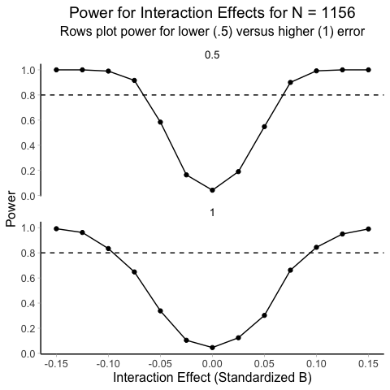

# Power Analysis

This is a power analysis for a mixed-model testing the effect of
adversity on average and subtest Woodcock Johnson scores. The background
for this model can be found in the [preregistration](../). The script
for performing the power analysis can be found here: [power analysis
script](../../scripts/power-simulation.R)

In short, because this is a secondary data analysis, our sample size is
fixed at (*N* = 1156). For the mixed model, the data will be stacked,
like so:

| id      | wj_sub_test   |    score |
|:--------|:--------------|---------:|
| id_0001 | wj_picvo_mean | 108.7500 |
| id_0001 | wj_vrba_mean  | 139.5000 |
| id_0001 | wj_pscmp_mean | 133.0000 |
| id_0001 | wj_appld_mean | 130.5000 |
| id_0001 | wj_memse_mean | 115.0000 |
| id_0001 | wj_incom_mean | 128.0000 |
| id_0001 | wj_memna_mean | 117.0000 |
| id_0001 | wj_lwid_mean  | 138.6667 |
| id_0001 | wj_wrdat_mean | 134.0000 |
| id_0001 | wj_calc_mean  | 143.0000 |

The model has the following terms:

- sum-coded contrasts for subtest
- adversity (standardized)
- interaction between contrast coded and adversity
- random intercept for participants (average over all subtests)

To perform a power analysis, we generated random adversity scores. Then
we created artificial dependencies between adversity and every subtest
and ran 500 simulations. The simulations explored the power to detect
the follwing sum contrast-coded interaction $\beta$ coefficients:

- $\beta=-.15$
- $\beta=-.125$
- $\beta=-.10$
- $\beta=-.075$
- $\beta=-.05$
- $\beta=.05$
- $\beta=.075$
- $\beta=.10$
- $\beta=.125$
- $\beta=.15$

For each run, we set the main effect of adversity to $\beta=-.2$. This
means the average effect adversity for of all subtests was always -.2.

Note that sum contrast-coded interaction $\beta$ reflect the *difference
in slopes* between the main effect of adversity and the effect of a
subtest. For example, if the main effect of adversity across all
subtests is -.3 and simple effect of a subtest and adversity = -.10, the
interaction effect will = .20 (difference between -.3 and -.10 is -.20).

I wrote the following function to make sure the main effect of adversity
was always -.20 and the effect of one subest set to one of the $\beta$
coefficients above.

``` r
## custom function for looking at betas
rnorm_fixed <- function(n, mean, sd, fixed_beta) {
  
  # force the mean and sd to be exactly as specified
  my_betas <- as.vector(mean + sd * scale(rnorm(n)))
  
  # difference between the mean of effects and the fixed beta differnence
  my_beta_diff <- my_betas[1] - (mean + fixed_beta)
  
  # Make the first value of the effects the fixed beta
  my_betas[1] <- mean + fixed_beta
  
  # randomly pick an effect to absorb the new value to keep the fixed mean
  random_replace <- sample(2:10, 1)
  
  # add the difference back to the vector
  my_betas[random_replace] <- my_betas[random_replace] + my_beta_diff
  
  # return the betas
  my_betas
}
```

Finally, we simulated models with higher and lower error in the
estimates. Noise was introduced by adding random values to test scores.
These values were drawn from a normal distribution with a mean of 0 and
a standard deviation of .5 (lower) or 1 (higher). Because we are
simulating standardized effects, the error values are akin to adding
z-scores to the outcome that ranged from 1/2 or 1 full standard
deviation of the sample mean for each test type.

Simulations revealed, that, with a sample size of (*N* = 1156), the
smallest interaction effect we can detect is $\beta$ = -.075 (or .075)
with 90% power, if error is small. When error is larger, we can detect
the same effect size with only 65% power. However, even with larger
error, we can detect a $\beta$ = -.10 (or .10) with 83% power.

Below are the full simulation results plotted as power curves:


